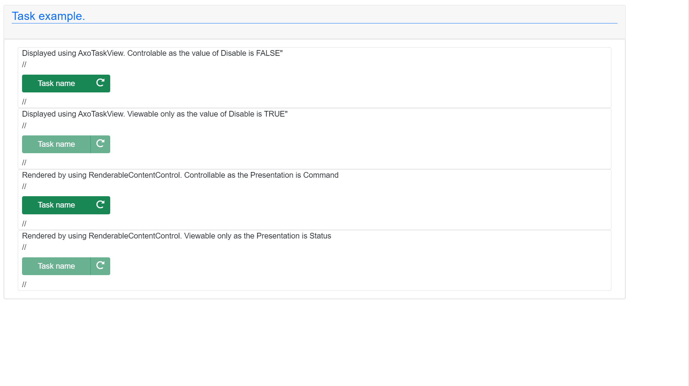
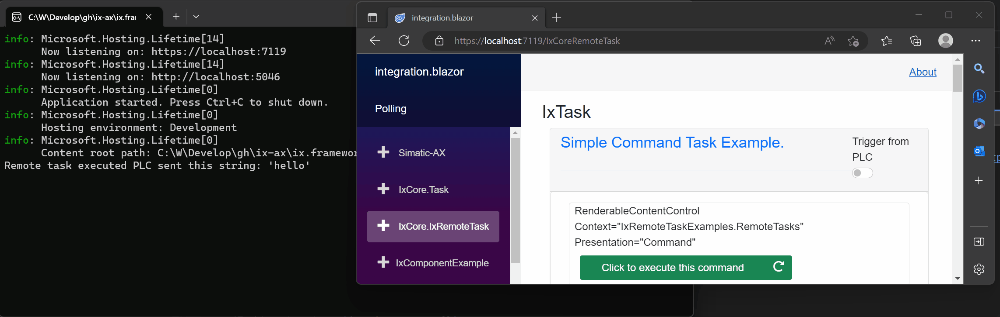
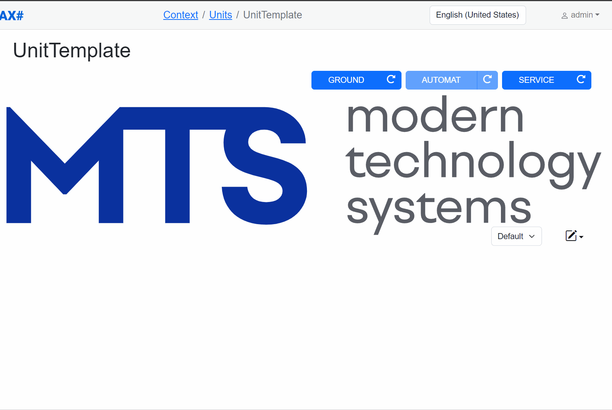
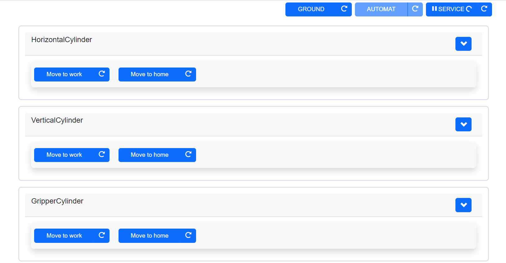
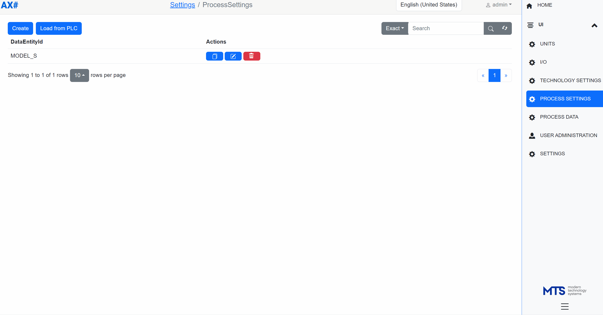

`AXOpen` (AXO) is an application framework for industrial automation applications. This project leverages the capabilities of [SIMATIC AX](https://simatic-ax.siemens.io) and [AX#](https://github.com/ix-ax/AXSharp), amalgamating their unique strengths to deliver a high level of OT IT convergence.

`AXOpen` is developed primarily as an application framework for and within [MTS](https://mts.sk/en). We opened this repository to share our knowledge and experience with the community of like-minded automation engineers, who see the potential in using software engineering approaches and workflows for industrial automation.

`AXOpen` is capitalizing on previous experiences in the development of [TcOpen](https://github.com/TcOpenGroup/), an application framework based on the `TwinCAT3` platform and [Inxton](https://docs.inxton.com/) technology that provided us with tooling that reduced the effort and development time for our industrial application by 70%.

`AXOpen` is engineered with an object-oriented architecture, bridging the real-time operations of a PLC controller and the extensive possibilities of the .NET ecosystem. This integration ensures unparalleled performance in automation tasks and forms an interface with the IT domain.

`AXOpen` is also highly modular, leveraging the `apax` package and dependency management system provided by SIMATIC-AX. In addition to controller packages, there are companion `NuGet` packages that can be used to extend SIMATIC-AX libraries in the .NET ecosystem.

# Guiding Principles

## Single Point of Change - SPOC(K)

The guiding principle in `AXOpen` is **Single Point Of Change**. The idea is that the tools and underlying framework should provide means to reflect any change in the controller program into higher applications. So for instance, any addition, removal, or modification of a component should be automatically reflected in the HMI/UI.

In the same way, any modification of a structure destined to be a source of data for an arbitrary target storage system should reflect automatically through multiple layers up to the target structure.

To achieve this level of scalability, `AXOpen` uses [AX#](https://github.com/ix-ax/AXSharp) which provides a transpiler that creates a .NET **twin** library for an ax-based project. The .NET twin reflects all types and project structures to allow for easy two-way structured access to the controller. The library can be regenerated on the fly with each change of the source project. These twin objects are then used by presentation libraries to generate HMI/UI or allow for mapping objects directly to the database.

## DEclarative COntrol Programming - DeCoP

Another leading principle is **DEclarative COntrol Programming**. This approach leverages OOP in ST. The main idea is to provide components where methods have declarative functions and encapsulate the imperatives to execute specific tasks. When the task cannot succeed or fails, the component reports information about the problem to the alarm handler.

The program composed with this principle provides a highly readable textual representation of expected actions while hiding implementation complexities for high-level readers like maintenance personnel.

A simple example could be a component of a pneumatic cylinder where the call of method `MoveToWork` will extend the piston into the working position; if the component does not reach the extremity sensor, the component itself provides the information that the operation could not successfully execute.

# Brief Content Overview

`AXOpen` is designed to simplify the development of industrial automation by covering a broad spectrum of areas. These include coordination (e.g., sequential control), alarm/messaging, components (pneumatics, vision, robotics, etc.), data acquisition, and various utility libraries.

Moreover, AXOpen comprises powerful tools that expedite the development of HMI/UI applications. It builds upon web technologies (Blazor) and the incredibly powerful [AX# library](https://ix-ax.github.io/axsharp/articles/blazor/RENDERABLECONTENT.html) for the automated generation of user interfaces. Each library/component within AXOpen comes equipped with ready-to-use visual components, enabling swift deployment in any human-machine interface scenario. Though we develop HMI/UI controls based on `Blazor` technology, we keep the design open to other UI technologies from the .NET ecosystem.

## Tasks

The task provides a simple coordination primitive to execute actions. Tasks provide additional benefits regarding handling and observability of executed actions.

~~~iecst
IF _myTask.Invoke().IsDone() THEN
    MoveToNextStep();
END_IF;
~~~

### Remote Tasks

In addition to tasks that are executed within the controller, `AXOpen` provides a mechanism for executing complex tasks that do not require the determinism of an industrial controller such as database access, extensive calculations, etc. A remote task is invoked from the controller, but the actual action is performed in a .NET application.

~~~iecst
IF(_remoteTask.Invoke('hello').IsDone()) THEN
    _doneCounter := _doneCounter + 1; 
END_IF; 
~~~

~~~CSharp
Entry.Plc.AxoRemoteTasks._remoteTask.Initialize(() => Console.WriteLine($"Remote task executed PLC sent this string: '{Entry.Plc.AxoRemoteTasks._remoteTask.Message.GetAsync().Result}'"));
~~~

## Controlling Sequences

Sequencers provide coordination patterns to orchestrate tasks into linear sequences.

## Components

Within `AXOpen`, we develop ready-to-use components for a variety of generic and vendor-specific hardware components (pneumatics, drives, sensors, etc.). Each component includes a ready-to-use visual element allowing control of the component manually.
Each component has built-in alarms that will report when a component encounters a problem.

## Data

`AXOpen` provides a powerful subsystem for managing data from the controller. `AXOpen` data management can be used in multiple scenarios like product traceability, customization of process control, etc.

---

**As we continue to make headway in our developmental journey, we request your patience. Stay tuned for updates regarding the upcoming releases of AXOpen.** Your interest, support, and feedback are invaluable to us, and we encourage you to engage with us during the evolution of this project.

To remain updated about our progress, consider starring and subscribing to this repository.

We are planning the first pilot project using `AXOpen` in the coming months. Once we verify the framework on the battlefield, we will release a production-ready version.

## Documentation

In parallel with the project's advancement, we are incrementally building the [documentation](https://ix-ax.github.io/AXOpen/). We invite you to visit the link if you wish to learn more about AXOpen.

## About the Repository

More about how the repository is organized and structured, see [here](src/README.md).