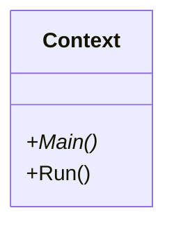
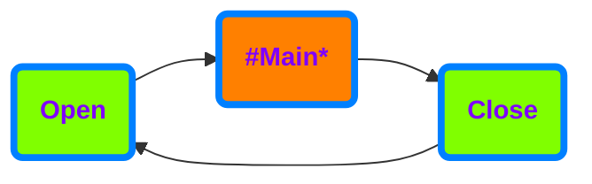

# IxContext

IxContext encapsulates entire application or application units. Any solution may contain one or more contexts, however the each should be considered to be an isolated island and any **direct inter-context access to members must be avoided**.

>[!NOTE] 
>Each IxContext must belong to a single PLC task.Multiple IxContexts can be however running on the same task.

In its basic implementation IxContext has relatively simple interface. `Main` is the method where we place all calls of our sub-routines. **In other words the `Run` is the root of the call tree of our program.**

`Run` method runs the IxContext. It must be called cyclically within a program unit that is attached to a cyclic `task`.

## Why do we need IxContext

 `IxContext` provides counters, object identification and other information about the execution of the program. These information is then used by the objects contained at different levels of the IxContext.

## How IxContext works

When you call `Run` method on an instance of a IxContext, it will ensure opening IxContext, running `Main` method (root of all your program calls) and IxContext closing.

## How to use IxContext

Base class for the IxContext is `ix.core.IxContext`. The entry point of call execution of the IxContext is `Main` method. Notice that the `IxContext` class is abstract and cannot be instantiated if not extended. `Main` method must be overridden in derived class notice the use of override keyword and also that the method is `protected` which means the it is visible only from within the `IxContext` and derived classes.

 **How to extend IxContext class**

[!code-smalltalk]

Cyclical call of the IxContext logic (`Main` method) is ensured when IxContext `Run` method is called. `Run` method is public therefore accessible and visible to any part of the program that whishes to call it.

**How to start IxContext's execution**

[!code-smalltalk]