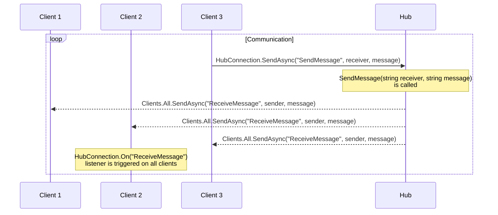

# **Client Identification**

Thanks to having [AXOpen.Security](~/articles/security/README.md) implemented, we are able to identify users using our application. The same user can be logged in on multiple clients at the same time and it is desirable to be able to have an account of which clients belong to which user. This article explains how this can be achieved and how we can send messages to specific clients in Blazor. This app is built on SignalR, an open-source library that simplifies adding real-time web functionality to apps.

## Prerequisities:

-   _Microsoft.AspNetCore.SignalR.Client_ NuGet package

## SignalR hub

### Creating a hub

To create a new SignalR hub, we need to create a class that inherits from the `Hub` class located in the `Microsoft.AspNetCore.SignalR` namespace. It is responsible for handling messages from clients and connection management. A simple demo of a SignalR hub can be found
in [ConnectionHub.cs](../../../src/clientchat/ClientIdentification/ConnectionHub.cs). The `ConnectionHub` class has a number of methods that can be overridden and methods specified by the user. E.g.:

-   `OnConnectedAsync()` - called when a new client connects to the hub
-   `OnDisconnectedAsync()` - called when a client disconnects from the hub
-   `SendMessage()` - _custom_ method that can be called by the client

### Hub set up in Blazor

To use the hub across all components in Blazor we need to create a service that will provide the Hub connection. See [HubConnectionProvider.cs](../../../src/clientchat/ClientIdentification/HubConnectionProvider.cs). The service is registered in the `Program.cs` file in the service configuration:

```csharp
builder.Services.AddSignalR();
builder.Services.AddScoped<HubConnectionProvider>();
```

Also in `Program.cs` we need to map the hub to a specific endpoint in the middleware pipeline:

```csharp
app.MapHub<ConnectionHub>("/connectionHub");
```

In `App.razor` we can then inject the `HubConnectionProvider` service and use it to create a connection to the hub:

```csharp
@inject HubConnectionProvider HubConnectionProvider

@code {
    protected override async Task OnInitializedAsync()
    {
        HubConnectionProvider.HubConnection = new HubConnectionBuilder()
            .WithUrl(NavigationManager.ToAbsoluteUri("/connectionHub"))
            .Build();

        await HubConnectionProvider.HubConnection.StartAsync();
    }
}
```

### Communication with the hub

To use the hub we need to first inject the `HubConnectionProvider` service into the component we want to use the hub in. To listen for messages from the hub we need to register a handler (a method that will be called when a message is received) using the `On` method. In [Index.razor.cs](../../../src/clientchat/Pages/Index.razor) e.g.:

```csharp
HubConnectionProvider.HubConnection.On<string, string>("ReceiveMessage", (sender, message) =>
{
    // do something
});
```

This will register a handler that will be called when a message with the name `ReceiveMessage` is received. The handler will be called with two parameters - `sender` and `message`. The types of the parameters need to be specified in the `On` method. This `ReceiveMessage` is called from the `ConnectionHub` in a `SendMessage` method:

```csharp
public async Task SendMessage(string receiver, string message)
{
    ...
    // sends message to all clients regardless of the receiver
    await Clients.All.SendAsync("ReceiveMessage", sender, message);
}
```

To trigger the `SendMessage` method from the client we can use the `InvokeAsync` method in a code behind of a component:

```csharp
await HubConnectionProvider.HubConnection.SendAsync("SendMessage", receiver, message);
```

Sequence diagram of the communication between the clients and the hub:



## How to identify clients

To be able to access currently logged in user in `ConnectionHub` we need to obtain the `.AspNetCore.Identity.Application` cookie used for identification. This is done in the `Host.cshtml` file:

```csharp
var cookie = HttpContext.Request.Cookies[".AspNetCore.Identity.Application"];
```

The cookie is then passed to the `App.razor` component as a parameter. In the code behind of the `App.razor` component, a cookie object is created and added to the `HubConnection` as a cookie container under `options.Cookies`:

```csharp
var cookieContainer = new CookieContainer();
var cookie = new Cookie()
{
    Name = ".AspNetCore.Identity.Application",
    Domain = NavigationManager.ToAbsoluteUri("/").Host,
    Value = IdentityCookie
};
cookieContainer.Add(cookie);

HubConnectionProvider.HubConnection = new HubConnectionBuilder()
    .WithUrl(NavigationManager.ToAbsoluteUri("/connectionHub"), options =>
    {
        options.Cookies = cookieContainer;
    })
    .Build();
```

By providing the cookie to the `HubConnection` we are now able to access the currently logged in user in the `ConnectionHub`:

```csharp
string name = Context.User.Identity.Name; // name of the currently logged in user
```

### Mapping client connection ids to user names

To by able to send messages to only those clients on which the specific user we want to send the message to is logged in, we need to map the client connection ids to the client's logged in user. The `ConnectionHub` contains a static variable `_connections` of type `ConnectionMapping<string>` that maps the client connection ids to the user names. The `ConnectionMapping` class is a simple dictionary that allows multiple values to be mapped to a single key. The `ConnectionMapping` class is defined in [ConnectionMapping.cs](../../../src/clientchat/ClientIdentification/ConnectionMapping.cs).

When a new client connects to the hub, the `OnConnectedAsync()` method is called. Each connection has a unique id which we can add to the `_connections` dictionary along with the user name of the currently logged in user:

```csharp
string name = Context.User.Identity.Name;
if (name != null)
{
    _connections.Add(name, Context.ConnectionId);
}
```

As it is implemented currently, when a user on a client is not logged in, the connection is not added to the mapping.

When a client disconnects from the hub, the `OnDisconnectedAsync()` method is called. We can then remove the connection id from the `_connections` dictionary:

```csharp
string name = Context.User.Identity.Name;
if (name != null)
{
    _connections.Remove(name, Context.ConnectionId);
}
```

### Sending messages to specific clients

To send a message to those clients on which the specific user is logged in, we need to obtain the connection ids of those clients. This is done by getting the values from the `_connections` dictionary using the user name as a key:

```csharp
var receiverConnections = _connections.GetConnections(receiver);
if (!receiverConnections.IsNullOrEmpty())
{
    await Clients.Clients(receiverConnections.ToList()).SendAsync("ReceiveMessage", name, message);
}
```

To send a message to all clients, we can use the `Clients.All.SendAsync()` method. if we want to send a message only to the caller (the client that called a `SendAsync` **to** the hub), we can use the `Clients.Caller.SendAsync()` method.
