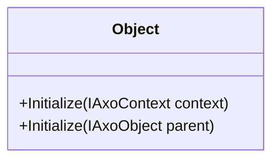

# AxoObject

AxoObject is the base class for any other classes of AXOpen.Core. It provides access to the parent AxoObject and the AxoContext in which it was initialized.

**AxoObject initialization within a AxoContext**
[!code-smalltalk]

**AxoObject initialization within another AxoObject**
[!code-smalltalk]
