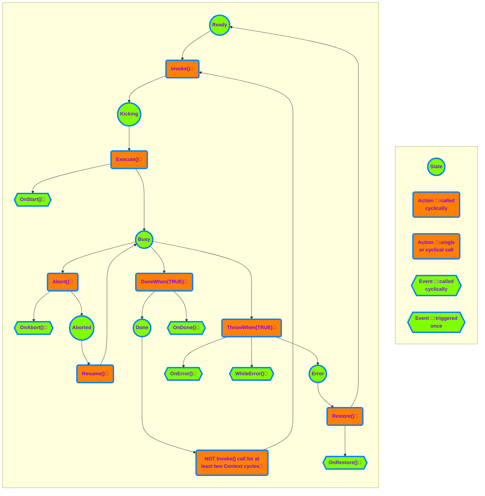

# AxoTask

AxoTask provides basic task execution. AxoTask needs to be initialized to set the proper AxoContext.

**AxoTask initialization within a AxoContext**

[!code-smalltalk]

There are two key methods for managing the AxoTask:

- `Invoke()` fires the execution of the AxoTask (can be called fire&forget or cyclically)
- `Execute()` method must be called cyclically. The method returns `TRUE` when the AxoTask is required to run until enters `Done` state or terminates in error.

For termination of the execution of the AxoTask there are following methods:
- `DoneWhen(Done_Condition)` - terminates the execution of the AxoTask and enters the `Done` state when the `Done_Condition` is `TRUE`.
- `ThrowWhen(Error_Condition)` - terminates the execution of the AxoTask and enters the `Error` state when the `Error_Condition` is `TRUE`.
- `Abort()` - terminates the execution of the AxoTask and enters the `Ready` state if the AxoTask is in the `Busy` state, otherwise does nothing.

To reset the AxoTask from any state in any moment there is following method:
- `Restore()` acts as reset of the AxoTask (sets the state into `Ready` state from any state of the AxoTask).

Moreover, there are seven more "event-like" methods that are called when a specific event occurs (see the chart below). 

Example of using AxoTask:

[!code-smalltalk]

The AxoTask executes upon the `Invoke` method call. `Invoke` fires the execution of `Execute` logic upon the first call, and it does not need cyclical calling.

[!code-smalltalk]

`Invoke()` method returns IAxoTaskState with the following members:

 - `IsBusy` indicates the execution started and is running.
 - `IsDone` indicates the execution completed with success.
 - `HasError` indicates the execution terminated with a failure.
 - `IsAborted` indicates that the execution of the AxoTask has been aborted. It should continue by calling the method `Resume()`.

Examples of using:
Invoking the AxoTask and waiting for its completion at the same place.
[!code-smalltalk]
Invoking the AxoTask and waiting for its completion at the different places.
[!code-smalltalk]
Checking if the AxoTask is executing.
[!code-smalltalk]
Check for the AxoTask's error state. 
[!code-smalltalk]

The AxoTask can be started only from the `Ready` state by calling the `Invoke()` method in the same Context cycle as the `Execute()` method is called, regardless the order of the methods calls. After AxoTask completion, the state of the AxoTask will remain in Done, unless:

1.) AxoTask's `Restore` method is called (AxoTask changes it's state to `Ready` state).

2.) `Invoke` method is not called for two or more consecutive cycles of its context (that usually means the same as PLC cycle); successive call of Invoke will switch the task into the Ready state and immediately into the `Kicking` state.

The AxoTask may finish also in an `Error` state. In that case, the only possibility to get out of `Error` state is by calling the `Restore()` method.

To implement any of the already mentioned "event-like" methods the new class that extends from the AxoTask needs to be created. The required method with `PROTECTED OVERRIDE` access modifier needs to be created as well, and the custom logic needs to be placed in.
These methods are:
- `OnAbort()` - executes once when the task is aborted.
- `OnResume()` - executes once when the task is resumed.
- `OnDone()` - executes once when the task reaches the `Done` state.
- `OnError()` - executes once when the task reaches the `Error` state.
- `OnRestore()` - executes once when the task is restored.
- `OnStart()` - executes once when the task starts (at the moment of transition from the `Kicking` state into the `Busy` state).
- `WhileError()` - executes repeatedly while the task is in `Error` state (and `Execute()` method is called).

Example of implementing "event-like" methods:
[!code-smalltalk]
