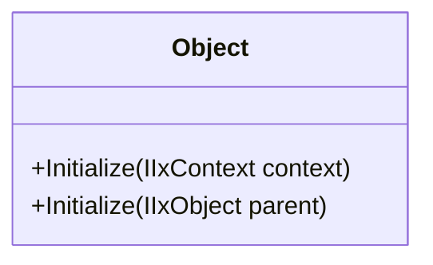

# IxObject

IxObject is the base class for any other classes of AXOpen. It provides access to the parent IxObject and the IxContext in which it was initialized.

**IxObject initialization within a IxContext**
[!code-smalltalk]

**IxObject initialization within another IxObject**
[!code-smalltalk]
