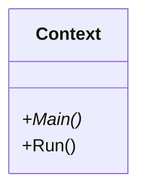
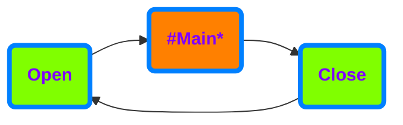
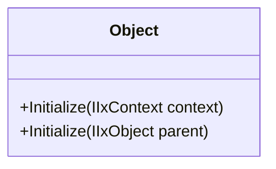
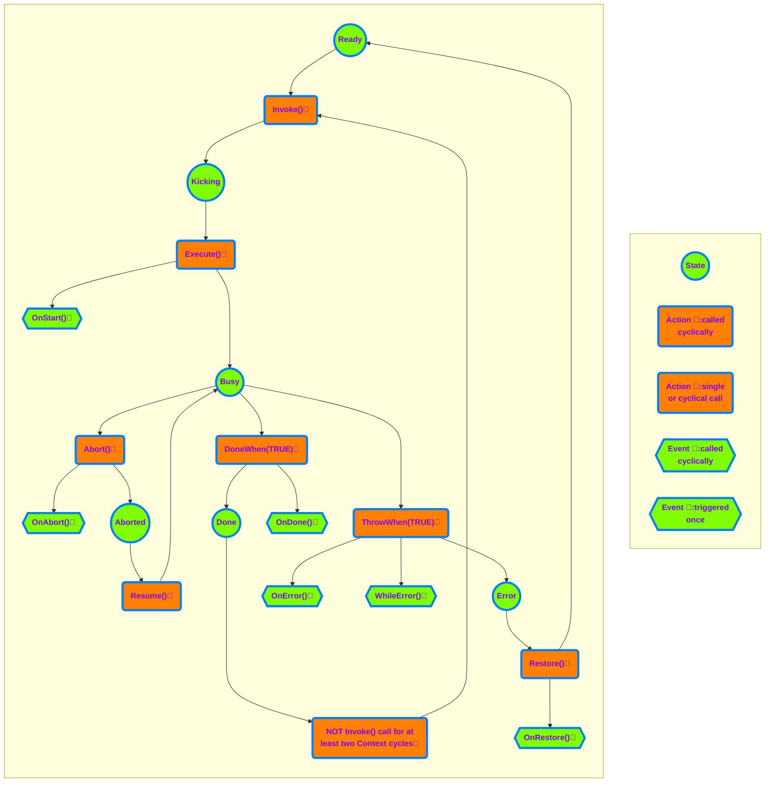

# **ix.core**

**ix.core** provides basic blocks for building ix.framework applications.

# Basic concepts

## IxContext

IxContext encapsulates entire application or application units. Any solution may contain one or more contexts, however the each should be considered to be an isolated island and any **direct inter-context access to members must be avoided**.

>[!NOTE] 
>Each IxContext must belong to a single PLC task.Multiple IxContexts can be however running on the same task.

In its basic implementation IxContext has relatively simple interface. `Main` is the method where we place all calls of our sub-routines. **In other words the `Run` is the root of the call tree of our program.**

`Run` method runs the IxContext. It must be called cyclically within a program unit that is attached to a cyclic `task`.

### Why do we need IxContext

 `IxContext` provides counters, object identification and other information about the execution of the program. These information is then used by the objects contained at different levels of the IxContext.

### How IxContext works

When you call `Run` method on an instance of a IxContext, it will ensure opening IxContext, running `Main` method (root of all your program calls) and IxContext closing.

### How to use IxContext

Base class for the IxContext is `ix.core.IxContext`. The entry point of call execution of the IxContext is `Main` method. Notice that the `IxContext` class is abstract and cannot be instantiated if not extended. `Main` method must be overridden in derived class notice the use of override keyword and also that the method is `protected` which means the it is visible only from within the `IxContext` and derived classes.

 **How to extend IxContext class**

[!code-smalltalk]

Cyclical call of the IxContext logic (`Main` method) is ensured when IxContext `Run` method is called. `Run` method is public therefore accessible and visible to any part of the program that whishes to call it.

**How to start IxContext's execution**

[!code-smalltalk]

## IxObject

IxObject is the base class for any other classes of ix.framework. It provides access to the parent IxObject and the IxContext in which it was initialized.

**IxObject initialization within a IxContext**
[!code-smalltalk]

**IxObject initialization within another IxObject**
[!code-smalltalk]

## IxTask

IxTask provides basic task execution. IxTask needs to be initialized to set the proper IxContext.

**IxTask initialization within a IxContext**

[!code-smalltalk]

There are two key methods for managing the IxTask:

- `Invoke()` fires the execution of the IxTask (can be called fire&forget or cyclically)
- `Execute()` method must be called cyclically. The method returns `TRUE` when the IxTask is required to run until enters `Done` state or terminates in error.

For termination of the execution of the IxTask there are following methods:
- `DoneWhen(Done_Condition)` - terminates the execution of the IxTask and enters the `Done` state when the `Done_Condition` is `TRUE`.
- `ThrowWhen(Error_Condition)` - terminates the execution of the IxTask and enters the `Error` state when the `Error_Condition` is `TRUE`.
- `Abort()` - terminates the execution of the IxTask and enters the `Ready` state if the IxTask is in the `Busy` state, otherwise does nothing.

To reset the IxTask from any state in any moment there is following method:
- `Restore()` acts as reset of the IxTask (sets the state into `Ready` state from any state of the IxTask).

Moreover, there are seven more "event-like" methods that are called when a specific event occurs (see the chart below). 

Example of using IxTask:

[!code-smalltalk]

The IxTask executes upon the `Invoke` method call. `Invoke` fires the execution of `Execute` logic upon the first call, and it does not need cyclical calling.

[!code-smalltalk]

`Invoke()` method returns IIxTaskState with the following members:

 - `IsBusy` indicates the execution started and is running.
 - `IsDone` indicates the execution completed with success.
 - `HasError` indicates the execution terminated with a failure.
 - `IsAborted` indicates that the execution of the IxTask has been aborted. It should continue by calling the method `Resume()`.

Examples of using:
Invoking the IxTask and waiting for its completion at the same place.
[!code-smalltalk]
Invoking the IxTask and waiting for its completion at the different places.
[!code-smalltalk]
Checking if the IxTask is executing.
[!code-smalltalk]
Check for the IxTask's error state. 
[!code-smalltalk]

The IxTask can be started only from the `Ready` state by calling the `Invoke()` method in the same Context cycle as the `Execute()` method is called, regardless the order of the methods calls. After IxTask completion, the state of the IxTask will remain in Done, unless:

1.) IxTask's `Restore` method is called (IxTask changes it's state to `Ready` state).

2.) `Invoke` method is not called for two or more consecutive cycles of its context (that usually means the same as PLC cycle); successive call of Invoke will switch the task into the Ready state and immediately into the `Kicking` state.

The IxTask may finish also in an `Error` state. In that case, the only possibility to get out of `Error` state is by calling the `Restore()` method.

To implement any of the already mentioned "event-like" methods the new class that extends from the IxTask needs to be created. The required method with `PROTECTED OVERRIDE` access modifier needs to be created as well, and the custom logic needs to be placed in.
These methods are:
- `OnAbort()` - executes once when the task is aborted.
- `OnResume()` - executes once when the task is resumed.
- `OnDone()` - executes once when the task reaches the `Done` state.
- `OnError()` - executes once when the task reaches the `Error` state.
- `OnRestore()` - executes once when the task is restored.
- `OnStart()` - executes once when the task starts (at the moment of transition from the `Kicking` state into the `Busy` state).
- `WhileError()` - executes repeatedly while the task is in `Error` state (and `Execute()` method is called).

Example of implementing "event-like" methods:
[!code-smalltalk]

## Step

IxStep is an extension class of the IxTask and provides the basics for the coordinated controlled execution of the task in the desired order based on the coordination mechanism used.

IxStep contains the `Execute()` method so as its base class overloaded and extended by following parameters:

- coord (mandatory): instance of the coordination controlling the execution of the IxStep.
- Enable (optional): if this value is `FALSE`, IxStep body is not executed and the current order of the execution is incremented. 
- Description (optional): IxStep description text describing the action the IxStep is providing.

IxStep class contains following public members:

- Order: Order of the IxStep in the coordination. This value can be set by calling the method `SetSteoOrder()` and read by the method `GetStepOrder()`.
- StepDescription: IxStep description text describing the action the IxStep is providing. This value can be set by calling the `Execute()` method with `Description` parameter.
- IsActive: if `TRUE`, the IxStep is currently executing, or is in the order of the execution, otherwise `FALSE`. This value can be set by calling the method `SetIsActive()` and read by the method `GetIsActive()`.                   
- IsEnabled: if `FALSE`, IxStep body is not executed and the current order of the execution is incremented. This value can be set by calling the method `SetIsEnabled()` or  calling the `Execute()` method with `Enable` parameter and read by the method `GetIsEnabled()`.                      

## IxSequencer

IxSequencer is an IxCordinator class provides triggering the IxStep-s inside the sequence in the order they are written.

IxSequencer extends from IxTask so it also has to be initialized by calling its `Initialize()` method and started using its `Invoke()` method.
    
IxSequencer contains following methods:
- `Open()`: this method must be called cyclically before any logic. It provides some configuration mechanism that ensures that the steps are going to be executed in the order, they are written. During the very first call of the sequence, no step is executed as the IxSequencer is in the configuring state. From the second context cycle after the IxSequencer has been invoked the IxSequencer change its state to running and starts the execution from the first step upto the last one. When IxSequencer is in running state, order of the step cannot be changed. 
- `MoveNext()`: Terminates the currently executed step and moves the IxSequencer's pointer to the next step in order of execution.
- `RequestStep()`: Terminates the currently executed step and set the IxSequencer's pointer to the order of the `RequestedStep`. When the order of the `RequestedStep` is higher than the order of the currently finished step (the requested step is "after" the current one) the requested step is started in the same context cycle. When the order of the `RequestedStep` is lower than the order of the currently finished step (the requested step is "before" the current one) the requested step is started in the next context cycle.
- `CompleteSequence()`: Terminates the currently executed step, completes (finishes) the execution of this IxSequencer and set the coordination state to Idle. If the `SequenceMode` of the IxSequencer is set to `Cyclic`, following `Open()` method call in the next context cycle switch it again into the configuring state, reasign the order of the individual steps (even if the orders have been changed) and subsequently set IxSequencer back into the running state. If the `SequenceMode` of the IxSequencer is set to `RunOnce`, terminates also execution of the IxSequencer itself.
- `GetCoordinatorState()': Returns the current state of the IxSequencer. 
    - `Idle`
    - `Configuring`: assigning the orders to the steps, no step is executed.
    - `Running`: orders to the steps are already assigned, step is executed.
- `SetSteppingMode()`: Sets the stepping mode of the IxSequencer. Following values are possible.
    - `None`:
    - `StepByStep`: if this mode is choosen, each step needs to be started by the invocation of the `StepIn` commmand.
    - `Continous`: if this mode is choosen (default), each step is started automaticcaly after the previous one has been completed.
- `GetSteppingMode()`: Gets the current stepping mode of the IxSequencer. 
- `SetSequenceMode()`: Sets the sequence mode of the IxSequencer. Following values are possible.
    - `None`:
    - `RunOnce`: if this mode is choosen, after calling the method `CompleteSequence()` the execution of the sequence is terminated.
    - `Cyclic`: if this mode is choosen (default), after calling the method `CompleteSequence()` the execution of the sequence is "reordered" and started from beginning.
- `GetSequenceMode()`: Gets the current sequence mode of the IxSequencer. 
- `GetNumberOfConfiguredSteps()`: Gets the number of the configured steps in the sequence. 

### Example of using IxSequencer
#### Example of the declaration of the IxSequencer and IxStep 
[!code-smalltalk]
#### Initialization
Initialization of the context needs to be called first. It does not need to be called cyclically, just once.
[!code-smalltalk]
#### Open
The `Open()` method must be called cyclically before any logic.
[!code-smalltalk]
#### Step
Example of the most simple use of the `Execute()` method of the `IxStep` class, only with the IxCoordinator defined. 
[!code-smalltalk]
Example of use of the `Execute()` method of the `IxStep` class with the Enable condition. 
This step is going to be executed just in the first run of the sequence, as during the second one, the Enable parameter will have the value of FALSE.
[!code-smalltalk]
Example of use of the `Execute()` method of the `IxStep` class with all three parameters defined.
[!code-smalltalk]

## IxComponent

`IxComponent` is an abstract class extending the IxObject, and it is the base building block for the "hardware-related devices" like a pneumatic piston, servo drive, robot, etc., so as for the, let's say, "virtual devices" like counter, database, etc. `IxComponent` is designed to group all possible methods, tasks, settings, and status information into one consistent class. As the `IxComponent` is an abstract class, it cannot be instantiated and must be extended. In the extended class, two methods are mandatory. 

`Restore()` - inside this method, the logic for resetting the IxComponent or restoring it from any state to its initial state should be placed.

`ManualControl()` - inside this method, the logic for manual operations with the component should be placed. To be able to control the `IxComponent` instance manually, the method `ActivateManualControl()` of this instance needs to be called cyclically.

The base class contains two additional method to deal with the manual control of the `IxComponent`. 
`ActivateManualControl()` - when this method is called cyclically, the `IxComponent` changes its behavior to manually controllable and ensure the call of the `ManualControl()` method in the derived class.

`IsManuallyControllable()` -returns `TRUE` when the `IxComponent` is manually controllable. 

**Layout attributes `ComponentHeader` and `ComponentDetails`**

The visual view of the extended `IxComponent` on the UI side could be done both ways. Manually with complete control over the design or by using the auto-rendering mechanism of the `RenderableContentControl` (TODO add a link to docu of the RenderableContentControl) element, which is, in most cases, more than perfect.
To take full advantage of the auto-rendering mechanism, the base class has implemented the additional layout attributes `ComponentHeader` and `ComponentDetails(TabName)`. The auto-rendered view is divided into two parts: the fixed one and the expandable one. 
All `IxComponent` members with the `ComponentHeader` layout attribute defined will be displayed in the fixed part. 
All members with the `ComponentDetails(TabName)` layout attribute defined will be displayed in the expandable part inside the `TabControl` with "TabName". 
All members are added in the order in which they are defined, taking into account their layout attributes like `Container(Layout.Wrap)` or `Container(Layout.Stack)`.

**How to implement `IxComponent`**

Example of the implementation very simple `IxComponent` with members placed only inside the Header.
[!code-smalltalk]

**How to use `IxComponent`**

The instance of the extended `IxComponent` must be defined inside the `IxContext`.
[!code-smalltalk]

Inside the `Main()` method of the related `IxContext` following rules must be applied. The `Initialize()` method of the extended instance of the `IxComponent` must be called first.
The `Run()` method with the respective input and output variables must be called afterwards.

**How to visualize `IxComponent`**

On the UI side use the `RenderableContentControl` and set its Context according the placement of the instance of the `IxComponent`.
[!code-csharp]

The rendered result should then looks as follows:

In case of more complex `IxComponent` the most important members should be placed in the fixed part (Header) and the rest of the members should be placed inside the expandable part (Details). The members inside the expandable part should be organize inside the tabs.  

**More complex `IxComponent`**
Example of the implementation more complex `IxComponent` with members placed also in several tabs inside the expandable part (Details).

[!code-smalltalk]

For the complex types of the `IxComponent` it is also recomended to organize partial groups of the members into the classes as it is in this example.

[!code-smalltalk]

Instantiate and call the `IxComponent` instance.

[!code-smalltalk]

UI side of the `IxComponent`.
[!code-csharp]

and the rendered result:

