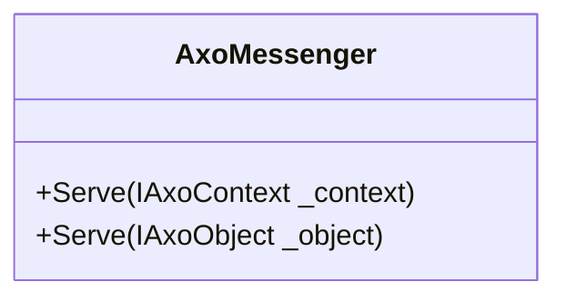

# AxoMessenger

Static `AxoMessenger` is a class that provides mechanism for delivering static message to the supervising applications (SCADA/HMI). This static messenger uses the text defined in the declaration. This text cannot be changed during runtime as the text is "transfered" just once during the compilation and it is not read during the runtime. The PLC code of the `AxoMessenger` just ensures the activation, deactivation and acknowledgement of the message. 

`AxoMessenger` contains following public methods. 

`Serve()` - this method must be called cyclically. It ensures the inicialization of the instance, so as the deactivation of the message.

`Activate(category)` - this method immediatelly activate the message of the category where category is of the type `eAxoMessageCategory`. Deactivation is detected after one PLC cycle without calling the method `Activate`.

`ActivateOnCondition(condition,category)` - this method activate the message of the category where category is of the type `eAxoMessageCategory` on the rising edge of the condition and imidiatelly deactivate the message on the falling edge of the condition. The `ActivateOnCondition` method is designed to be called cyclically. 

>[!NOTE] 
>Do not use the both activation methods on the same `AxoMessenger` instance, please use just one of them.

`Acknowledge()` - acknowledge the message if required. The message could be acknowledged so as before deactivation so as after.

Depending on the [eAxoMessageCategory](/apictrl/abstractions/plc.AXOpen.Messaging.eAxoMessageCategory.html) the messenger should require the acknowledgement.

By default the acknowledgement is not required for the levels `Trace`,`Debug`,`Info`,`TimedOut`,`Notification` and `Warning`. 
This could be overwritten by calling the `RequireAcknowledgement()` method. 
Contrariwise, the acknowledgement is required for the levels `Error`,`ProgrammingError`,`Critical`,`Fatal` and `Catastrophic` by default. This could be overwritten by calling the `DoNotRequireAcknowledgement()` method. 

**Attributes `MessageText` and `Help`**

These attributes are used to set the values of the static texts of the messenger. These values are read out at the compilation time transfered to .NET counterpart and set as a constant strings. Therefore they can't be changed at the runtime.

Example of declaration the instance and defining the attributes `MessageText` and `Help`.
[!code-smalltalk]

**How to use `AxoMessenger`**

The instance of the `AxoMessenger` must be defined inside the `AxoContext` or `AxoObject`. 
Inside the `Main()` method of the related `AxoContext` or inside the cyclically called method of the `AxoObject` following rules must be applied. The `Serve()` method of the instance of the `AxoMessenger` must be called cyclically.
The `Activate` method should be used called the required condition or the `AcitvateOnCondition` should be called cyclically. Avoid to mix using the both methods with the same instance.
[!code-smalltalk]

If neccessary, the default behaviour of the acknowledgeable messenger should be changed as follows.
[!code-smalltalk]
Contrariwise, the default behaviour of the unacknowledgeable messenger should be changed as follows.
[!code-smalltalk]

**How to visualize `AxoMessenger`**

On the UI side use the `RenderableContentControl` and set its Context according the placement of the instance of the `AxoMessenger`.
[!code-csharp]

See also [AxoLogger](../logging/AXOLOGGER.md#axologger-and-axomessenger)