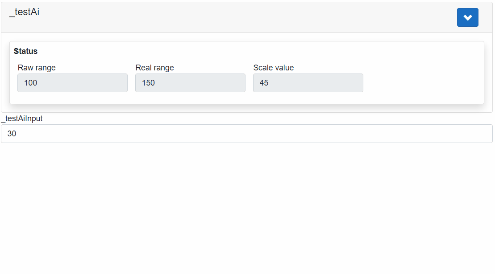

## AXOpenElements.AxoAi

AxoAi is used for checking values of analogue inputs. AxoAi scales input signal based on values in `AxoAiConfig` class.

AxoAiConfig contains:

[!code-smalltalk]

### Example

[!code-smalltalk]

[!code-smalltalk]

