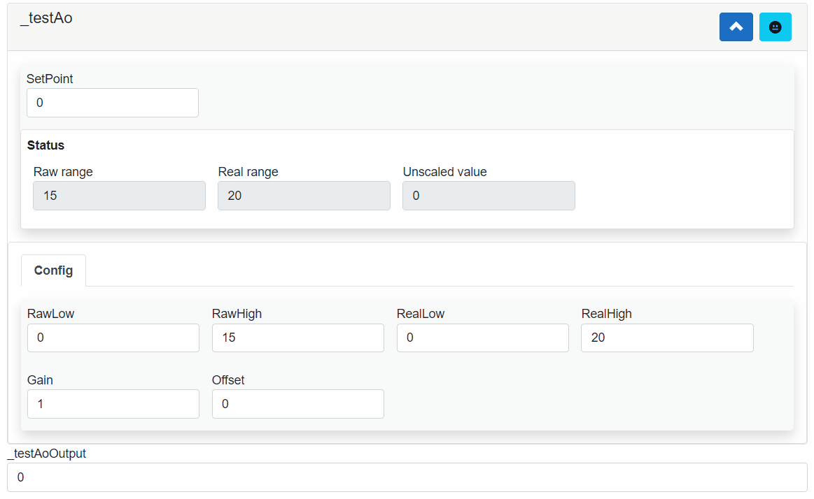

## AXOpenElements.AxoAo

AxoAo is used for setting analogue values. AxoAo un-scales input signal based on `SetPoint` and values in `AxoAoConfig` class.

[!code-smalltalk]

### Example

[!code-smalltalk]

[!code-smalltalk]

