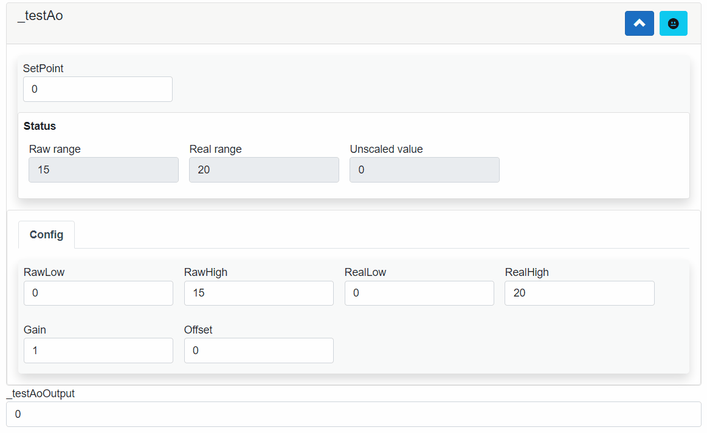

# AxoAo

AxoAo is used for setting analogue values. AxoAo un-scales input signal based on `SetPoint` and values in `AxoAoConfig` class.

AxoAoConfig contains:

[!code-pascal]

# How to

# [CONTROLLER](#tab/controller)

# How to use component in controller

## Declare component

[!code-pascal]

## Declare initialization variables

*Most of the initialization variable will come from the I/O system. This example is only for demostrational puproses.*

[!code-pascal]

## Manual Control

[!code-pascal]

## Apply configuration

[!code-pascal]

## Initialize & Run

[!code-pascal]

[!INCLUDE [IntializeAndRun](../../../docfx/articles/notes/CYCLIC_UPDATE_NOTICE.md)]

## Use

[!code-pascal]

# [.NET TWIN](#tab/twin)

## Source

View the .NET twin source at [`components.elements`](https://github.com/Inxton/AXOpen/tree/3-unify-showcase/src/components.elements/src/).

# [BLAZOR](#tab/blazor)

`AxoAo` ships a dedicated Blazor view (`AxoAoView`) supporting multiple presentations.

## Status display

[!code-html]

## Command control

[!code-html]

## Generic rendering via `RenderableContentControl`

Alternatively, render via `RenderableContentControl` which inspects the component at runtime and selects the matching view based on the `Presentation` attribute:

[!code-html]

[!code-html]

## Source

View the dedicated view at [`AxoAoView.razor`](https://github.com/Inxton/AXOpen/tree/3-unify-showcase/src/components.elements/src/AXOpen.Components.Elements.blazor/AxoAoView.razor).

---
