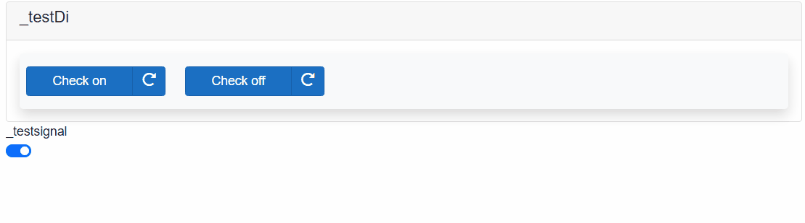

## AXOpenElements.AxoDi

AxoDi is used for checking values of digital inputs.

# How to

# [CONTROLLER](#tab/controller)

# How to use component in controller

## Declare component

[!code-smalltalk]

## Declare initialization variables

*Most of the initialization variable will come from the I/O system. This example is only for demostrational puproses.*

[!code-smalltalk]

## Manual Control

[!code-smalltalk]

## Initialize & Run

[!code-smalltalk]

[!INCLUDE [IntializeAndRun](../../../docfx/articles/notes/CYCLIC_UPDATE_NOTICE.md)]

## Use

[!code-smalltalk]

# [.NET TWIN](#tab/twin)

# [BLAZOR](#tab/blazor)

