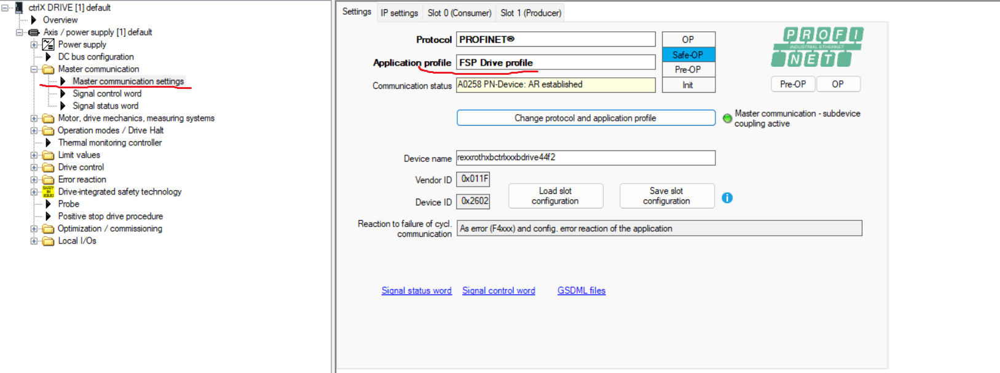
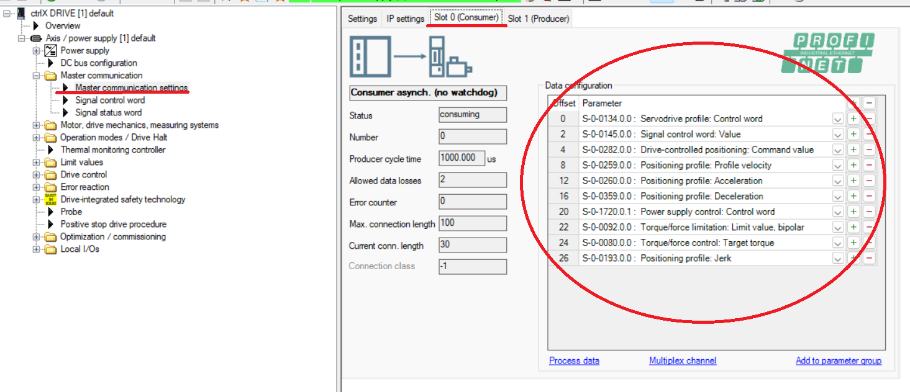
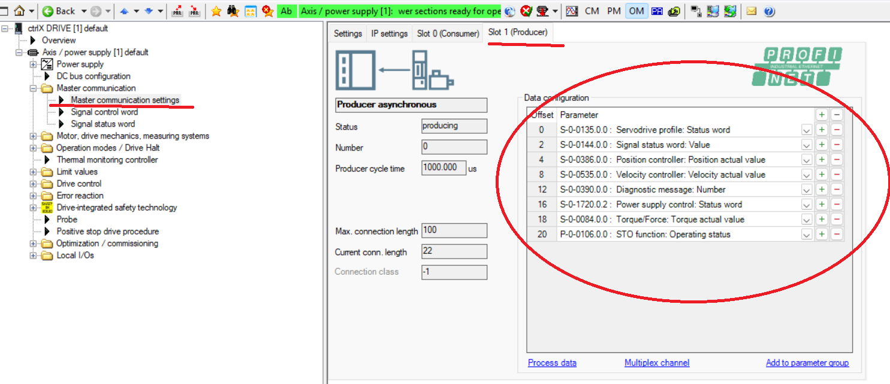
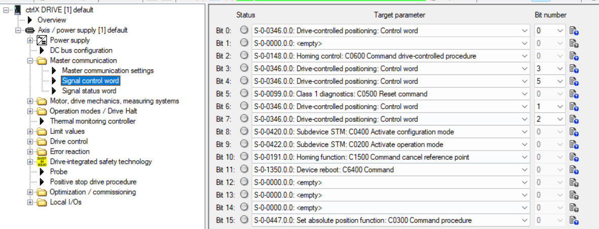
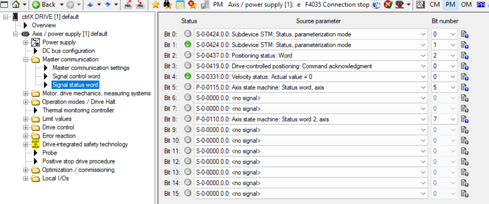
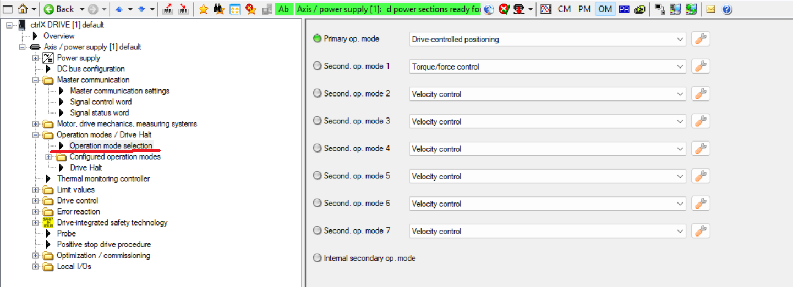

# AxoCtrlxDriveXsc

_Rexroth ctrlX DRIVE XSC servo drive_

Generated documentation for the `AxoCtrlxDriveXsc` component.

# [CONTROLLER](#tab/controller)

## Declare component

[!code-pascal]

## Declare initialization variables

*Most of the initialization variables come from the I/O system. The example below is for demonstration purposes.*

[!code-pascal]

## Initialize & Run

[!code-pascal]

[!INCLUDE [IntializeAndRun](../../../docfx/articles/notes/CYCLIC_UPDATE_NOTICE.md)]

## Use

[!code-pascal]

## Source

View the library source at [`AxoCtrlxDriveXsc.st`](https://github.com/Inxton/AXOpen/tree/dev/src/components.rexroth.drives/ctrl/src/AxoCtrlxDriveXsc/v_6_x_x/AxoCtrlxDriveXsc.st).

# [.NET TWIN](#tab/twin)

## Source

View the .NET twin source at [`AXOpen.Components.Rexroth.Drives`](https://github.com/Inxton/AXOpen/tree/dev/src/components.rexroth.drives/src/AXOpen.Components.Rexroth.Drives/).

# [BLAZOR](#tab/blazor)

`AxoCtrlxDriveXsc` ships a dedicated Blazor view, `AxoCtrlxDriveXscView`, with `Status`, `Command`, and `Spot` derivatives. `RenderableContentControl` automatically resolves and renders this dedicated view at runtime based on the selected `Presentation`, so the markup below renders the dedicated view without importing it explicitly.

## Status display

[!code-html]

## Command control

[!code-html]

## Type-agnostic status view

[!code-html]

## Type-agnostic command view

[!code-html]

Available `Presentation` values: `Status-Display`, `Command-Control`, `Service-Control`, `Spot`, `Compact`.

## Source

View the dedicated view at [`AxoCtrlxDriveXscView.razor`](https://github.com/Inxton/AXOpen/tree/1146-ctrlxdrive/src/components.rexroth.drives/src/AXOpen.Components.Rexroth.Drives.blazor/AxoCtrlxDriveXsc/AxoCtrlxDriveXscView.razor), or the whole Blazor package at [`AXOpen.Components.Rexroth.Drives.blazor`](https://github.com/Inxton/AXOpen/tree/1146-ctrlxdrive/src/components.rexroth.drives/src/AXOpen.Components.Rexroth.Drives.blazor/).

# [HARDWARE](#tab/hardware)

## Device template

PROFINET hardware template at `showcase/app/hwc/library_templates/rexroth_ctrlx_drive/`.

## Device instantiation

[!code-yaml]

## IO system wiring

[!code-yaml]

## Drive commissioning (ctrlX DRIVE Engineering)

The controller firmware must be version 06.12.00 or later. This software package was tested with firmware version FWA-XD1-AXS-V-0612N-NN-00.
Earlier firmware versions exhibited unstable behavior, including the controller becoming unresponsive and failing to recover automatically. In such cases, recovery was only possible by physically disconnecting the controller from the power supply.

Before the controller can exchange cyclic process data with `AxoCtrlxDriveXsc`,
the drive must be parameterized in the **ctrlX DRIVE Engineering** commissioning
tool. The cyclic Consumer/Producer telegram and the signal control/status words
configured here must match the layout the component expects on its
`AxisRefExt` inputs and outputs. Perform the steps in order.

### 1. Master communication — PROFINET + FSP Drive profile

Under **Master communication → Master communication settings**, set the
protocol to **PROFINET®** and the application profile to **FSP Drive profile**.
Confirm the master communication is active (e.g. `AR established`) and note the
assigned PROFINET device name, which must match the device entry in
`plc_line.hwl.yml`.

### 2. Consumer — cyclic setpoint data (controller → drive)

Configure the **Consumer** telegram (Slot 0) with the cyclic data the drive
receives from the controller: the servodrive-profile control word and the
drive-controlled-positioning command values (target position, velocity,
acceleration profile). This is the process data the component writes through
`AxisRefExt.Outputs`.

### 3. Producer — cyclic actual/status data (drive → controller)

Configure the **Producer** telegram (Slot 1) with the cyclic data the drive
sends back: the servodrive-profile status word, position feedback, torque/force
actual value, velocity, and the diagnostic message. This is the process data
the component reads through `AxisRefExt.Inputs`.

### 4. Signal control word

Map the **Signal control word** bits to the drive parameters the component
drives (control word and field-bus control bits). The bit assignments must
match the order the component expects in its `SignalControlWord_S_0_0145_0_0`.

### 5. Signal status word

Map the **Signal status word** bits to the source parameters reported back
(status word, position-feedback status, field-bus status, actual values). The
component decodes these bits to derive its `SignalStatusWord_S_0_0144_0_0`.

### 6. Operation mode selection

Under **Operation modes / Drive Halt → Operation mode selection**, set the
**primary operation mode** to **Drive-controlled positioning** and the
secondary operation modes (e.g. **Torque/force control**, **Velocity control**)
to match the motion tasks you intend to use from `AxoCtrlxDriveXsc`.

---
