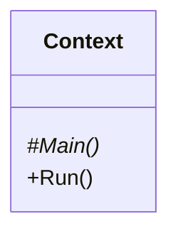
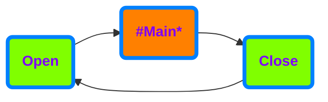
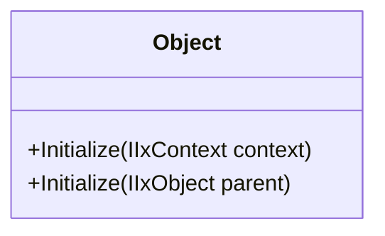
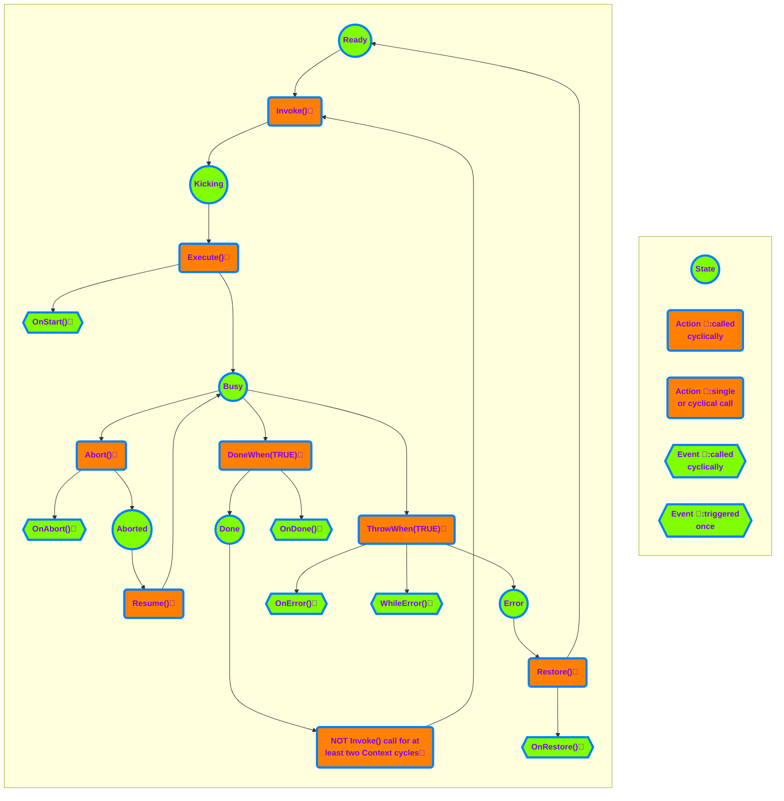

# **ix.core**

**ix.core** provides basic blocks for building ix.framework applications.

# Basic concepts

## IxContext

IxContext encapsulates entire application or application units. Any solution may contain one or more contexts, however the each should be considered to be an isolated island and any **direct inter-context access to members must be avoided**.

**IMPORTANT** Each IxContext must belong to a single PLC task. Multiple IxContexts can be however running on the same task.

In its basic implementation IxContext has relatively simple interface. The main method is the method where we place all calls of our sub-routines. **In other words the `Main` is the root of the call tree of our program.**

`Run` method runs the IxContext. It must be called cyclically within a program unit that is attached to a cyclic `task`.

### Why do we need IxContext

 `IxContext` provides counters, object identification and other information about the execution of the program. These information is then used by the objects contained at different levels of the IxContext.

### How IxContext works

When you call `Run` method on an instance of a IxContext, it will ensure opening IxContext, running `Main` method (root of all your program calls) and IxContext closing.

### How to use IxContext

Base class for the IxContext is `ix.core.IxContext`. The entry point of call execution of the IxContext is `Main` method. Notice that the `IxContext` class is abstract and cannot be instantiated if not extended. `Main` method must be overridden in derived class notice the use of override keyword and also that the method is `protected` which means the it is visible only from within the `IxContext` and derived classes.

 
 **How to extend IxContext class**

~~~SmallTalk

USING ix.core

CLASS PUBLIC MyContext EXTENDS IxContext
    METHOD PROTECTED OVERRIDE Main
        // Here goes all your logic for given IxContext.
    END_METHOD
END_CLASS
~~~

Cyclical call of the IxContext logic (`Main` method) is ensured when IxContext `Execute` method is called. `Execute` method is public therefore accessible and visible to any part of the program that whishes to call it.

**How to start IxContext's execution**

~~~SmallTalk
PROGRAM MyProgram
    VAR
        _myContext : MyContext;
    END_VAR

    _myContext.Run();
END_PROGRAM
~~~

## IxObject

IxObject is the base class for any other classes of ix.framework. It provides access to the parent IxObject and the IxContext in which it was initialized.

**IxObject initialization within a IxContext**

~~~SmallTalk
    CLASS PUBLIC MyContext EXTENDS ix.core.IxContext
        VAR
            _myObject : ix.core.IxObject;
        END_VAR
        METHOD PROTECTED OVERRIDE Main
            _myObject.Initialize(THIS);            
        END_METHOD
    END_CLASS
~~~

**IxObject initialization within another IxObject**

~~~SmallTalk
    CLASS PUBLIC MyParentObject EXTENDS ix.core.IxObject
        VAR
            _myChildObject : ix.core.IxObject;
        END_VAR
        METHOD PROTECTED OVERRIDE Main
            _myChildObject.Initialize(THIS);            
        END_METHOD
    END_CLASS
~~~

## IxTask

IxTask provides basic task execution. IxTask needs to be initialized to set the proper IxContext.

**IxTask initialization within a IxContext**

~~~SmallTalk
    CLASS IxTaskExample EXTENDS IxContext         
        VAR PUBLIC
            _myTask : IxTask;
            _myCounter : ULINT;
        END_VAR
    
        METHOD PUBLIC Initialize
            // Initialization of the context needs to be called first
            // It does not need to be called cyclically, just once
            _myTask.Initialize(THIS);
        END_METHOD
    END_CLASS  
~~~

There are two key methods for managing the IxTask:

- `Invoke()` fires the execution of the IxTask (can be called fire&forget or cyclically)
- `Execute()` method must be called cyclically. The method returns `TRUE` when the IxTask is required to run until enters `Done` state or terminates in error.

For termination of the execution of the IxTask there are following methods:
- `DoneWhen(Done_Condition)` - terminates the execution of the IxTask and enters the `Done` state when the `Done_Condition` is `TRUE`.
- `ThrowWhen(Error_Condition)` - terminates the execution of the IxTask and enters the `Error` state when the `Error_Condition` is `TRUE`.
- `Abort()` - terminates the execution of the IxTask and enters the `Ready` state if the IxTask is in the `Busy` state, otherwise does nothing.

To reset the IxTask from any state in any moment there is following method:
- `Restore()` acts as reset of the IxTask (sets the state into `Ready` state from any state of the IxTask).

Moreover, there are seven more "event-like" methods that are called when a specific event occurs (see the chart below). 

Example of using IxTask:
~~~SmallTalk
    CLASS IxTaskExample EXTENDS IxContext         
        VAR PUBLIC
            _myTask : IxTask;
            _myCounter : ULINT;
        END_VAR
    
        METHOD PUBLIC Initialize
            // Initialization of the context needs to be called first
            // It does not need to be called cyclically, just once
            _myTask.Initialize(THIS);
        END_METHOD

        METHOD PROTECTED OVERRIDE Main
            // Cyclicall call of the Execute
            IF _myTask.Execute() THEN
                _myCounter := _myCounter + ULINT#1;
                _myTask.DoneWhen(_myCounter = ULINT#100);
            END_IF;
        END_METHOD
    END_CLASS  
~~~

The IxTask executes upon the `Invoke` method call. `Invoke` fires the execution of `Execute` logic upon the first call, and it does not need cyclical calling.

~~~SmallTalk
    _myTask.Invoke();
~~~

`Invoke()` method returns IIxTaskState with the following members:

 - `IsBusy` indicates the execution started and is running.
 - `IsDone` indicates the execution completed with success.
 - `HasError` indicates the execution terminated with a failure.
 - `IsAborted` indicates that the execution of the IxTask has been aborted. It should continue by calling the method `Resume()`.

~~~SmallTalk
            // Wait for IxTask to Complete 
            IF _myTask.Invoke().IsDone() THEN
                ; //Do something
            END_IF;
            // ALTERNATIVELY
            _myTask.Invoke();
            IF _myTask.IsDone() THEN
                ; //Do something ALTERNATIV
            END_IF;
~~~

~~~SmallTalk
            // Make sure that the IxTask is executing 
            IF _myTask.Invoke().IsBusy() THEN
                ; //Do something
            END_IF;
~~~

~~~SmallTalk
            // Check for IxTask's error 
            IF _myTask.Invoke().HasError() THEN
                ; //Do something
            END_IF;
~~~

The IxTask can be started only from the `Ready` state by calling the `Invoke()` method in the same Context cycle as the `Execute()` method is called, regardless the order of the methods calls. After IxTask completion, the state of the IxTask will remain in Done, unless:

1.) IxTask's `Restore` method is called (IxTask changes it's state to `Ready` state).

2.) `Invoke` method is not called for two or more consecutive cycles of its context (that usually means the same as PLC cycle); successive call of Invoke will switch the task into the Ready state and immediately into the `Kicking` state.

The IxTask may finish also in an `Error` state. In that case, the only possibility to get out of `Error` state is by calling the `Restore()` method.

To implement any of the already mentioned "event-like" methods the new class that extends from the IxTask needs to be created. The required method with `PROTECTED OVERRIDE` access modifier needs to be created as well, and the custom logic needs to be placed in.
These methods are:
- `OnAbort()` - executes once when the task is aborted.
- `OnResume()` - executes once when the task is resumed.
- `OnDone()` - executes once when the task reaches the `Done` state.
- `OnError()` - executes once when the task reaches the `Error` state.
- `OnRestore()` - executes once when the task is restored.
- `OnStart()` - executes once when the task starts (at the moment of transition from the `Kicking` state into the `Busy` state).
- `WhileError()` - executes repeatedly while the task is in `Error` state (and `Execute()` method is called).

Example of implementing "event-like" methods:
~~~SmallTalk
    CLASS MyCommandTask Extends CommandTask
        VAR
            OnAbortCounter : ULINT;
            OnResumeCounter : ULINT;
            OnDoneCounter : ULINT;
            OnErrorCounter : ULINT;
            OnRestoreCounter : ULINT;
            OnStartCounter : ULINT;
            WhileErrorCounter : ULINT;
        END_VAR
        METHOD PROTECTED OVERRIDE OnAbort 
            OnAbortCounter := OnAbortCounter + ULINT#1;
        END_METHOD

        METHOD PROTECTED OVERRIDE OnResume 
            OnResumeCounter := OnResumeCounter + ULINT#1;
        END_METHOD

        METHOD PROTECTED OVERRIDE OnDone 
            OnDoneCounter := OnDoneCounter + ULINT#1;
        END_METHOD
    
        METHOD PROTECTED OVERRIDE OnError 
            OnErrorCounter := OnErrorCounter + ULINT#1;
        END_METHOD

        METHOD PROTECTED OVERRIDE OnRestore 
            OnRestoreCounter := OnRestoreCounter + ULINT#1;
        END_METHOD

        METHOD PROTECTED OVERRIDE OnStart 
            OnStartCounter := OnStartCounter + ULINT#1;
        END_METHOD

        METHOD PROTECTED OVERRIDE WhileError 
            WhileErrorCounter := WhileErrorCounter + ULINT#1;
        END_METHOD    
    END_CLASS
~~~
## Step

IxStep is an extension class of the IxTask and provides the basics for the coordinated controlled execution of the task in the desired order based on the coordination mechanism used.

IxStep contains the `Execute()` method so as its base class overloaded and extended by following parameters:

- coord (mandatory): instance of the coordination controlling the execution of the IxStep.
- Enable (optional): if this value is `FALSE`, IxStep body is not executed and the current order of the execution is incremented. 
- Description (optional): IxStep description text describing the action the IxStep is providing.

IxStep class contains following public members:

- Order: Order of the IxStep in the coordination. This value can be set by calling the method `SetSteoOrder()` and read by the method `GetStepOrder()`.
- StepDescription: IxStep description text describing the action the IxStep is providing. This value can be set by calling the `Execute()` method with `Description` parameter.
- IsActive: if `TRUE`, the IxStep is currently executing, or is in the order of the execution, otherwise `FALSE`. This value can be set by calling the method `SetIsActive()` and read by the method `GetIsActive()`.                   
- IsEnabled: if `FALSE`, IxStep body is not executed and the current order of the execution is incremented. This value can be set by calling the method `SetIsEnabled()` or  calling the `Execute()` method with `Enable` parameter and read by the method `GetIsEnabled()`.                      

## IxSequencer

IxSequencer is an IxCordinator class provides triggering the IxStep-s inside the sequence in the order they are written.

IxSequencer extends from IxTask so it also has to be initialized by calling its `Initialize()` method and started using its `Invoke()` method.
    
IxSequencer contains following methods:
- `Open()`: this method must be called cyclically before any logic. It provides some configuration mechanism that ensures that the steps are going to be executed in the order, they are written. During the very first call of the sequence, no step is executed as the IxSequencer is in the configuring state. From the second context cycle after the IxSequencer has been invoked the IxSequencer change its state to running and starts the execution from the first step upto the last one. When IxSequencer is in running state, order of the step cannot be changed. 
- `MoveNext()`: Terminates the currently executed step and moves the IxSequencer's pointer to the next step in order of execution.
- `RequestStep()`: Terminates the currently executed step and set the IxSequencer's pointer to the order of the `RequestedStep`. When the order of the `RequestedStep` is higher than the order of the currently finished step (the requested step is "after" the current one) the requested step is started in the same context cycle. When the order of the `RequestedStep` is lower than the order of the currently finished step (the requested step is "before" the current one) the requested step is started in the next context cycle.
- `CompleteSequence()`: Terminates the currently executed step, completes (finishes) the execution of this IxSequencer and set the coordination state to Idle. If the `SequenceMode` of the IxSequencer is set to `Cyclic`, following `Open()` method call in the next context cycle switch it again into the configuring state, reasign the order of the individual steps (even if the orders have been changed) and subsequently set IxSequencer back into the running state. If the `SequenceMode` of the IxSequencer is set to `RunOnce`, terminates also execution of the IxSequencer itself.
- `GetCoordinatorState()': Returns the current state of the IxSequencer. 
    - `Idle`
    - `Configuring`: assigning the orders to the steps, no step is executed.
    - `Running`: orders to the steps are already assigned, step is executed.
- `SetSteppingMode()`: Sets the stepping mode of the IxSequencer. Following values are possible.
    - `None`:
    - `StepByStep`: if this mode is choosen, each step needs to be started by the invocation of the `StepIn` commmand.
    - `Continous`: if this mode is choosen (default), each step is started automaticcaly after the previous one has been completed.
- `GetSteppingMode()`: Gets the current stepping mode of the IxSequencer. 
- `SetSequenceMode()`: Sets the sequence mode of the IxSequencer. Following values are possible.
    - `None`:
    - `RunOnce`: if this mode is choosen, after calling the method `CompleteSequence()` the execution of the sequence is terminated.
    - `Cyclic`: if this mode is choosen (default), after calling the method `CompleteSequence()` the execution of the sequence is "reordered" and started from beginning.
- `GetSequenceMode()`: Gets the current sequence mode of the IxSequencer. 
- `GetNumberOfConfiguredSteps()`: Gets the number of the configured steps in the sequence. 

~~~SmallTalk
    CLASS IxSequencerExample EXTENDS IxContext
        VAR PUBLIC
            _mySequencer : IxSequencer;
            _step_1 : IxStep;
            _step_2 : IxStep;
            _step_3 : IxStep;
            _myCounter : ULINT;
        END_VAR
    
        METHOD PUBLIC Initialize
            // Initialization of the context needs to be called first
            // It does not need to be called cyclically, just once
            _mySequencer.Initialize(THIS);
            _step_1.Initialize(THIS);
            _step_2.Initialize(THIS);
            _step_3.Initialize(THIS);
        END_METHOD

        METHOD PROTECTED OVERRIDE Main
            _mySequencer.Open();

            // Example of the most simple use of Execute() method of step class, only with IxCoordinator defined. 
            IF _step_1.Execute(_mySequencer) THEN
                // do something
                _myCounter := _myCounter + ULINT#1;
                IF (_myCounter MOD ULINT#5) = ULINT#0 THEN
                    // continue to the next step of the sequence
                    _mySequencer.MoveNext();
                END_IF;
            END_IF;

            // Example of use of the Execute() method of step class with Enable condition.
            // This step is going to be executed just in the first run of the sequence,
            // as during the second run, the Enable parameter will have the value of FALSE.
            IF _step_2.Execute(coord := _mySequencer, Enable := _myCounter <= ULINT#20) THEN
                _myCounter := _myCounter + ULINT#1;
                IF _myCounter = ULINT#20 THEN
                    // Jumping to step 1. As it is jumping backwards, the execution of step 1  
                    // is going to be started in the next context cycle.
                    _mySequencer.RequestStep(_step_1);
                END_IF;
            END_IF;

            // Example of use of the Execute() method of step class with all three parameters defined.
            IF _step_3.Execute(coord := _mySequencer, Enable := TRUE, Description := 'This is a description of the step 3' ) THEN
                _myCounter := _myCounter + ULINT#1;
                IF (_myCounter MOD ULINT#7) = ULINT#0 THEN
                    // Finalize the sequence and initiate the execution from the first step.
                    _mySequencer.CompleteSequence();
                END_IF;
            END_IF;
        END_METHOD   
    END_CLASS
~~~

## IxComponent

`IxComponent` is an abstract class extending the IxObject, and it is the base building block for the "hardware-related devices" like a pneumatic piston, servo drive, robot, etc., so as for the, let's say, "virtual devices" like counter, database, etc. `IxComponent` is designed to group all possible methods, tasks, settings, and status information into one consistent class. As the `IxComponent` is an abstract class, it cannot be instantiated and must be extended. In the extended class, two methods are mandatory. 

`Restore()` - inside this method, the logic for resetting the IxComponent or restoring it from any state to its initial state should be placed.

`ManualControl()` - inside this method, the logic for manual operations with the component should be placed. To be able to control the `IxComponent` instance manually, the method `ActivateManualControl()` of this instance needs to be called cyclically.

The base class contains two additional method to deal with the manual control of the `IxComponent`. 
`ActivateManualControl()` - when this method is called cyclically, the `IxComponent` changes its behavior to manually controllable and ensure the call of the `ManualControl()` method in the derived class.

`IsManuallyControllable()` -returns `TRUE` when the `IxComponent` is manually controllable. 

**Layout attributes `ComponentHeader` and `ComponentDetails`**

The visual view of the extended `IxComponent` on the UI side could be done both ways. Manually with complete control over the design or by using the auto-rendering mechanism of the `RenderableContentControl` (TODO add a link to docu of the RenderableContentControl) element, which is, in most cases, more than perfect.
To take full advantage of the auto-rendering mechanism, the base class has implemented the additional layout attributes `ComponentHeader` and `ComponentDetails(TabName)`. The auto-rendered view is divided into two parts: the fixed one and the expandable one. 
All `IxComponent` members with the `ComponentHeader` layout attribute defined will be displayed in the fixed part. 
All members with the `ComponentDetails(TabName)` layout attribute defined will be displayed in the expandable part inside the `TabControl` with "TabName". 
All members are added in the order in which they are defined, taking into account their layout attributes like `Container(Layout.Wrap)` or `Container(Layout.Stack)`.

**How to implement `IxComponent`**

Example of the implementation very simple `IxComponent` with members placed only inside the Header.
~~~SmallTalk
using ix.framework.core;

{#ix-attr:[Container(Layout.Stack)]}
{#ix-set:AttributeName = "Component with header only example"}
CLASS PUBLIC ComponentHeaderOnlyExample EXTENDS IxComponent 
    METHOD PROTECTED OVERRIDE Restore: IIxTask 
        // Some logic for Restore could be placed here.
        // For Example:
        valueReal := REAL#0.0;
        valueDint := DINT#0;
    END_METHOD

    METHOD PROTECTED OVERRIDE ManualControl
        // Some logic for manual control could be placed here.
        ;
    END_METHOD

    // Main method of the `IxComponent` that needs to be called inside the `IxContext` cyclically.
    METHOD PUBLIC Run
        // Declaration of the input and output variables.
        // In the case of "hardware-related" `IxComponent`, 
        // these would be the variables linked to the hardware. 
        VAR_INPUT 
            inReal : REAL;
            inDint : DINT;
        END_VAR
        VAR_OUTPUT
            outReal : REAL;
            outDint : DINT;
        END_VAR
        
        // This must be called first.
        SUPER.Open();

        // Place the custom logic here.
        valueReal := valueReal * inReal;
        valueDint := valueDint + inDint;

        outReal := valueReal;
        outDint := valueDint;
    END_METHOD 

    VAR PUBLIC
        {#ix-attr:[Container(Layout.Wrap)]}
        {#ix-attr:[ComponentHeader()]}        
        {#ix-set:AttributeName = "Real product value"}
        valueReal : REAL := REAL#1.0; 
        {#ix-attr:[ComponentHeader()]}        
        {#ix-set:AttributeName = "Dint sum value"}
        valueDint : DINT:= DINT#0; 
    END_VAR
END_CLASS
~~~

**How to use `IxComponent`**

The instance of the extended `IxComponent` must be defined inside the `IxContext`.
~~~SmallTalk
.....................EXTENDS ix.framework.core.IxContext
        VAR PUBLIC
            {#ix-set:AttributeName = "Very simple component example with header only defined"}
            MyComponentWithHeaderOnly : ComponentHeaderOnlyExample;  
        END_VAR
~~~

Inside the `Main()` method of the related `IxContext` following rules must be applied. The `Initialize()` method of the extended instance of the `IxComponent` must be called first.
The `Run()` method with the respective input and output variables must be called afterwards.
~~~SmallTalk

~~~
