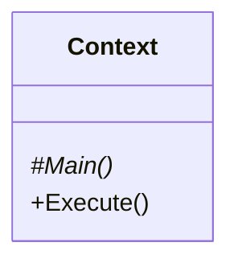
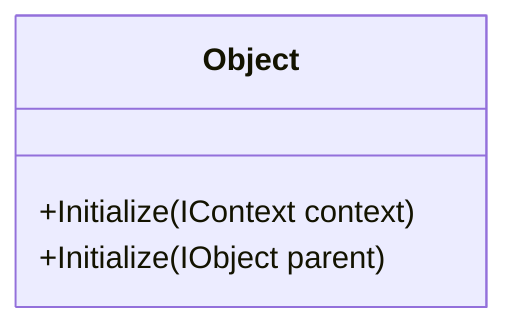
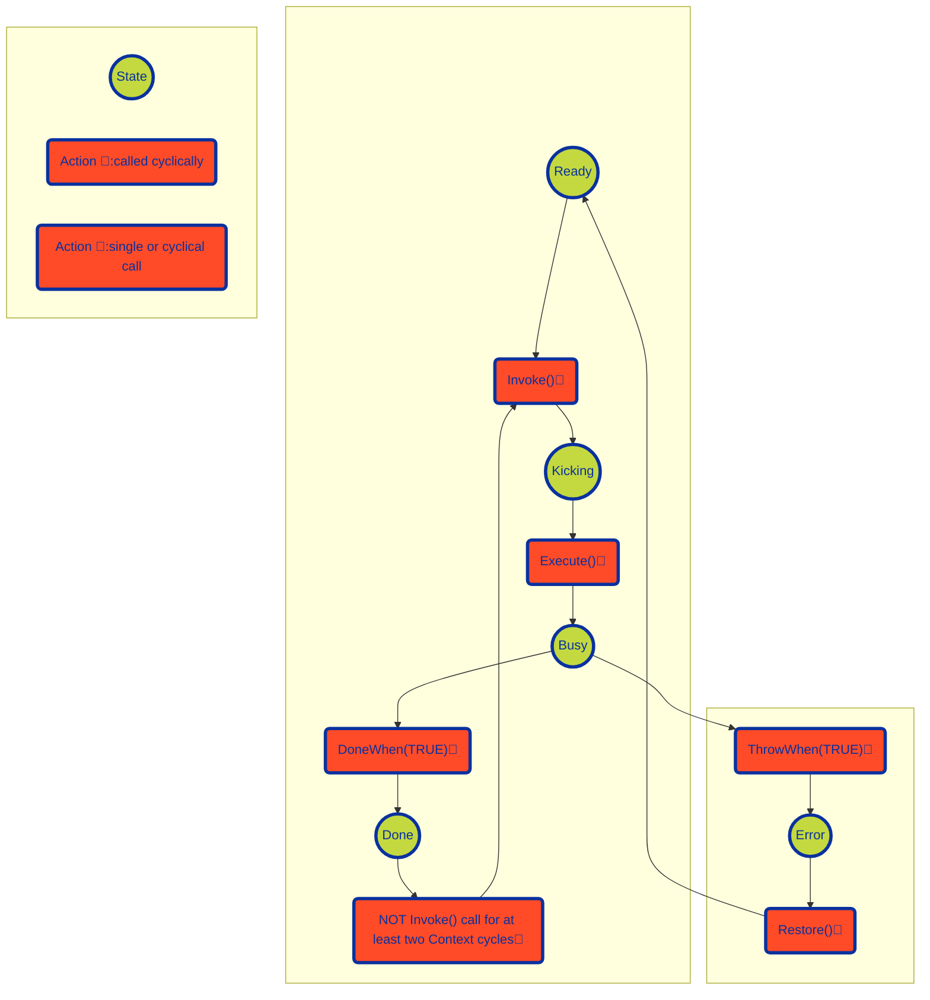

# **ix.core**

**ix.core** provides basic blocks for building ix.framework applications.

# Basic concepts

## Context

Context encapsulates entire application or application units. Any solution may contain one or more contexts, however the each should be considered to be an isolated island and any **direct inter-context access to members must be avoided**.

**IMPORTANT** Each context must belong to a single PLC task. Multiple contexts can be however running on the same task.

In its basic implementation context has relatively simple interface. The main method is the method where we place all calls of our sub-routines. **In other words the `Main` is the root of the call tree of our program.**

`Execute` method runs the context. It must be called cyclically within a program unit that is attached to a cyclic `task`.

### Why do we need context

 `Context` provides counters, object identification and other information about the execution of the program. These information is then used by the objects contained at different levels of the context.

### How context works

When you call `Execute` method on an instance of a context, it will ensure opening context, running `Main` method (root of all your program calls) and context closing.

```mermaid
  flowchart LR
    id1(Open)-->id2(#Main*)-->id3(Close)-->id1(Open)
    style id1 fill:#fff,stroke:#333,stroke-width:2px
    style id2 fill:#000,stroke:#f66,stroke-width:2px
    style id3 fill:#fff,stroke:#333,stroke-width:4px

```

### How to use context

Base class for the context is `ix.core.Context`. The entry point of call execution of the context is `Main` method. Notice that the `context` class is abstract and cannot be instantiated if not extended. `Main` method must be overridden in derived class notice the use of override keyword and also that the method is `protected` which means the it is visible only from within the `Context` and derived classes.

 
 **How to extend Context class**

~~~iecst

USING ix.core

CLASS PUBLIC MyContext EXTENDS Context
    METHOD PROTECTED OVERRIDE Main
        // Here goes all your logic for given context.
    END_METHOD
END_CLASS
~~~

Cyclical call of the context logic (`Main` method) is ensured when context `Execute` method is called. `Execute` method is public therefore accessible and visible to any part of the program that whishes to call it.

**How to start context's execution**

~~~iecst
PROGRAM MyProgram
    VAR
        _myContext : MyContext;
    END_VAR

    _myContext.Execute();
END_PROGRAM
~~~

## Object

Object is the base class for any other classes of ix.framework. It provides access to the parent object and the context in which it was initialized.

**Object initialization within a context**

~~~SmallTalk
    CLASS PUBLIC MyContext EXTENDS ix.core.Context
        VAR
            _myObject : ix.core.Object;
        END_VAR
        METHOD PROTECTED OVERRIDE Main
            _myObject.Initialize(THIS);            
        END_METHOD
    END_CLASS
~~~

**Object initialization within another object**

~~~SmallTalk
    CLASS PUBLIC MyParentObject EXTENDS ix.core.Object
        VAR
            _myChildObject : ix.core.Object;
        END_VAR
        METHOD PROTECTED OVERRIDE Main
            _myChildObject.Initialize(THIS);            
        END_METHOD
    END_CLASS
~~~

## CommandTask

Command task provides basic task execution. CommandTask needs to be initialized to set the proper context.

**CommandTask initialization within a context**

~~~SmallTalk
    CLASS CommandTaskExample EXTENDS Context         
        VAR PUBLIC
            _myCommandTask : CommandTask;
            _myCounter : ULINT;
        END_VAR
    
        METHOD PUBLIC Initialize
            // Initialization of the context needs to be called before the command is used in the program.
            // It does not need to be called cyclically.            
            _myCommandTask.Initialize(THIS);
        END_METHOD
    END_CLASS  
~~~

There are two key methods for managing the command:

[-] `Invoke()` fires the execution of the command (can be called fire&forget or cyclically)

[-] `Execute()` method must be called cyclically. The method returns `TRUE` when the command is required to run until enters `Done` state or terminates in error.

[-] `Restore()` acts as reset of the command (sets the state into `Ready` state).

~~~SmallTalk
    CLASS CommandTaskExample EXTENDS Context         
        VAR PUBLIC
            _myCommandTask : CommandTask;
            _myCounter : ULINT;
        END_VAR
    
        METHOD PUBLIC Initialize
            // Initialization of the context needs to be called before the command is used in the program.
            // It does not need to be called cyclically.
            _myCommandTask.Initialize(THIS);
        END_METHOD

        METHOD PROTECTED OVERRIDE Main
            // Cyclicall call of the Execute
            IF _myCommandTask.Execute() THEN
                _myCounter := _myCounter + ULINT#1;
                _myCommandTask.DoneWhen(_myCounter = ULINT#100);
            END_IF;
        END_METHOD
    END_CLASS  
~~~

The task executes upon the `Invoke` method call. `Invoke` fires the execution of `Execute` logic upon the first call, and it does not need cyclical calling.

~~~SmallTalk
    _myCommandTask.Invoke();
~~~

`Invoke()` method returns ICommandTaskState with the following members:

 - `IsBusy` indicates the execution started and is running.
 - `IsDone` indicates the execution completed with success.
 - `HasError` indicates the execution terminated with a failure.

~~~SmallTalk
            // Wait for CommandTask to Complete 
            IF _myCommandTask.Invoke().IsDone() THEN
                ; //Do something
            END_IF;
            
            // ALTERNATIVELY
            _myCommandTask.Invoke();
            IF _myCommandTask.IsDone() THEN
                ; //Do something ALTERNATIV
            END_IF;
~~~

~~~SmallTalk
            // Make sure that the command task is executing 
            IF _myCommandTask.Invoke().IsBusy() THEN
                ; //Do something
            END_IF;
~~~

~~~SmallTalk
            // Check for command task's error 
            IF _myCommandTask.Invoke().HasError() THEN
                ; //Do something
            END_IF;
~~~

The command task can be started only from the `Ready` state by calling the `Invoke()` method in the same Context cycle as the `Execute()` method is called, regardless the order of the methods calls. After command task completion, the state of the command task will remain in Done, unless:

1.) Command task's `Restore` method is called (command task changes it's state to `Ready` state).

2.) `Invoke` method is not called for two or more consecutive cycles of its context (that usually means the same as PLC cycle); successive call of Invoke will switch the task into the Ready state and immediately into the Kicking state.

The command task may finish also in an `Error` state. In that case, the only possibility to get out of `Error` state is by calling the `Restore()` method.
