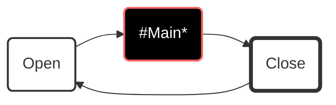

# **ix.core**

**ix.core** provides basic blocks for building ix.framework applications.

# Basic concepts

## Context

Context encapsulates entire application or application units. Any solution may contain one or more contexts, however the each should be considered to be an isolated island and any **direct inter-context access to members must be avoided**.

**IMPORTANT** Each context must belong to a single PLC task. Multiple contexts can be however running on the same task.

In its basic implementation context has relatively simple interface. The main method is the method where we place all calls of our sub-routines. **In other words the `Main` is the root of the call tree of our program.**

`Execute` method runs the context. It must be called cyclically within a program unit that is attached to a cyclic `task`.

### Why do we need context

 `Context` provides counters, object identification and other information about the execution of the program. These information is then used by the objects contained at different levels of the context.

### How context works

When you call `Execute` method on an instance of a context, it will ensure opening context, running `Main` method (root of all your program calls) and context closing.

### How to use context

Base class for the context is `ix.core.Context`. The entry point of call execution of the context is `Main` method. Notice that the `context` class is abstract and cannot be instantiated if not extended. `Main` method must be overridden in derived class notice the use of override keyword and also that the method is `protected` which means the it is visible only from within the `Context` and derived classes.

 
 **How to extend Context class**

~~~SmallTalk

USING ix.core

CLASS PUBLIC MyContext EXTENDS Context
    METHOD PROTECTED OVERRIDE Main
        // Here goes all your logic for given context.
    END_METHOD
END_CLASS
~~~

Cyclical call of the context logic (`Main` method) is ensured when context `Execute` method is called. `Execute` method is public therefore accessible and visible to any part of the program that whishes to call it.

**How to start context's execution**

~~~SmallTalk
PROGRAM MyProgram
    VAR
        _myContext : MyContext;
    END_VAR

    _myContext.Execute();
END_PROGRAM
~~~

## Object

Object is the base class for any other classes of ix.framework. It provides access to the parent object and the context in which it was initialized.

**Object initialization within a context**

~~~SmallTalk
    CLASS PUBLIC MyContext EXTENDS ix.core.Context
        VAR
            _myObject : ix.core.Object;
        END_VAR
        METHOD PROTECTED OVERRIDE Main
            _myObject.Initialize(THIS);            
        END_METHOD
    END_CLASS
~~~

**Object initialization within another object**

~~~SmallTalk
    CLASS PUBLIC MyParentObject EXTENDS ix.core.Object
        VAR
            _myChildObject : ix.core.Object;
        END_VAR
        METHOD PROTECTED OVERRIDE Main
            _myChildObject.Initialize(THIS);            
        END_METHOD
    END_CLASS
~~~

## CommandTask

Command task provides basic task execution. CommandTask needs to be initialized to set the proper context.

**CommandTask initialization within a context**

~~~SmallTalk
    CLASS CommandTaskExample EXTENDS Context         
        VAR PUBLIC
            _myCommandTask : CommandTask;
            _myCounter : ULINT;
        END_VAR
    
        METHOD PUBLIC Initialize
            // Initialization of the context needs to be called before the command is used in the program.
            // It does not need to be called cyclically.            
            _myCommandTask.Initialize(THIS);
        END_METHOD
    END_CLASS  
~~~

There are two key methods for managing the command:

[-] `Invoke()` fires the execution of the command (can be called fire&forget or cyclically)

[-] `Execute()` method must be called cyclically. The method returns `TRUE` when the command is required to run until enters `Done` state or terminates in error.

[-] `Restore()` acts as reset of the command (sets the state into `Ready` state).

~~~SmallTalk
    CLASS CommandTaskExample EXTENDS Context         
        VAR PUBLIC
            _myCommandTask : CommandTask;
            _myCounter : ULINT;
        END_VAR
    
        METHOD PUBLIC Initialize
            // Initialization of the context needs to be called before the command is used in the program.
            // It does not need to be called cyclically.
            _myCommandTask.Initialize(THIS);
        END_METHOD

        METHOD PROTECTED OVERRIDE Main
            // Cyclicall call of the Execute
            IF _myCommandTask.Execute() THEN
                _myCounter := _myCounter + ULINT#1;
                _myCommandTask.DoneWhen(_myCounter = ULINT#100);
            END_IF;
        END_METHOD
    END_CLASS  
~~~

The task executes upon the `Invoke` method call. `Invoke` fires the execution of `Execute` logic upon the first call, and it does not need cyclical calling.

~~~SmallTalk
    _myCommandTask.Invoke();
~~~

`Invoke()` method returns ICommandTaskState with the following members:

 - `IsBusy` indicates the execution started and is running.
 - `IsDone` indicates the execution completed with success.
 - `HasError` indicates the execution terminated with a failure.

~~~SmallTalk
            // Wait for CommandTask to Complete 
            IF _myCommandTask.Invoke().IsDone() THEN
                ; //Do something
            END_IF;
            
            // ALTERNATIVELY
            _myCommandTask.Invoke();
            IF _myCommandTask.IsDone() THEN
                ; //Do something ALTERNATIV
            END_IF;
~~~

~~~SmallTalk
            // Make sure that the command task is executing 
            IF _myCommandTask.Invoke().IsBusy() THEN
                ; //Do something
            END_IF;
~~~

~~~SmallTalk
            // Check for command task's error 
            IF _myCommandTask.Invoke().HasError() THEN
                ; //Do something
            END_IF;
~~~

The command task can be started only from the `Ready` state by calling the `Invoke()` method in the same Context cycle as the `Execute()` method is called, regardless the order of the methods calls. After command task completion, the state of the command task will remain in Done, unless:

1.) Command task's `Restore` method is called (command task changes it's state to `Ready` state).

2.) `Invoke` method is not called for two or more consecutive cycles of its context (that usually means the same as PLC cycle); successive call of Invoke will switch the task into the Ready state and immediately into the Kicking state.

The command task may finish also in an `Error` state. In that case, the only possibility to get out of `Error` state is by calling the `Restore()` method.

## Step

Step is an extension class of the CommandTask and provides the basics for the coordinated controlled execution of the task in the desired order based on the coordination mechanism used.

Step contains the `Execute()` method so as its base class overloaded and extended by following parameters:

- coord (mandatory): instance of the coordination controlling the execution of the step.
- Enable (optional): if this value is `FALSE`, step body is not executed and the current order of the execution is incremented. 
- Description (optional): step description text describing the action the step is providing.

Step class contains following public members:

- Order: Order of the step in the coordination. This value can be set by calling the method `SetStepOrder()` and read by the method `GetStepOrder()`.
- StepDescription: step description text describing the action the step is providing. This value can be set by calling the `Execute()` method with `Description` parameter.
- IsActive: if `TRUE`, the step is currently executing, or is in the order of the execution, otherwise `FALSE`. This value can be set by calling the method `SetIsActive()` and read by the method `GetIsActive()`.                   
- IsEnabled: if `FALSE`, step body is not executed and the current order of the execution is incremented. This value can be set by calling the method `SetIsEnabled()` or  calling the `Execute()` method with `Enable` parameter and read by the method `GetIsEnabled()`.                      

## Sequencer

Sequencer is a cordinator class provides triggering the steps inside the sequence in the order they are written.

Sequencer extends from CommandTask so it also has to be initialized by calling its `Initialize()` method and started using its `Invoke()` method.
    
Sequencer contains following methods:
- `Open()`: this method must be called cyclically before any logic. It provides some configuration mechanism that ensures that the steps are going to be executed in the order, they are written. During the very first call of the sequence, no step is executed as the sequencer is in the configuring state. From the second context cycle after the sequencer has been invoked the sequencer change its state to running and starts the execution from the first step upto the last one. When sequencer is in running state, order of the step cannot be changed. 
- `MoveNext()`: Terminates the currently executed step and moves the sequencer's pointer to the next step in order of execution.
- `RequestStep()`: Terminates the currently executed step and set the sequencer's pointer to the order of the `RequestedStep`. When the order of the `RequestedStep` is higher than the order of the currently finished step (the requested step is "after" the current one) the requested step is started in the same context cycle. When the order of the `RequestedStep` is lower than the order of the currently finished step (the requested step is "before" the current one) the requested step is started in the next context cycle.
- `CompleteSequence()`: Terminates the currently executed step, completes (finishes) the execution of this sequencer and set the coordination state to Idle. If the `SequenceMode` of the sequencer is set to `Cyclic`, following `Open()` method call in the next context cycle switch it again into the configuring state, reasign the order of the individual steps (even if the orders have been changed) and subsequently set sequencer back into the running state. If the `SequenceMode` of the sequencer is set to `RunOnce`, terminates also execution of the sequencer itself.
- `GetCoordinatorState()': Returns the current state of the sequencer. 
    - `Idle`
    - `Configuring`: assigning the orders to the steps, no step is executed.
    - `Running`: orders to the steps are already assigned, step is executed.
- `SetSteppingMode()`: Sets the stepping mode of the sequencer. Following values are possible.
-- `None`:
-- `StepByStep`: if this mode is choosen, each step needs to be started by the invocation of the `StepIn` commmand.
-- `Continous`: if this mode is choosen (default), each step is started automaticcaly after the previous one has been completed.
- `GetSteppingMode()`: Gets the current stepping mode of the sequencer. 
- `SetSequenceMode()`: Sets the sequence mode of the sequencer. Following values are possible.
-- `None`:
-- `RunOnce`: if this mode is choosen, after calling the method `CompleteSequence()` the execution of the sequence is terminated.
-- `Continous`: if this mode is choosen (default), after calling the method `CompleteSequence()` the execution of the sequence is "reordered" and started from beginning.
- `GetSequenceMode()`: Gets the current sequence mode of the sequencer. 
- `GetNumberOfConfiguredSteps()`: Gets the number of the configured steps in the sequence. 

~~~SmallTalk
    CLASS SequencerExample EXTENDS Context
        VAR PUBLIC
            _mySequencer : Sequencer;
            _step_1 : Step;
            _step_2 : Step;
            _step_3 : Step;
            _myCounter : ULINT;
        END_VAR
    
        METHOD PUBLIC Initialize
            // Initialization of the context needs to be called first
            // It does not need to be called cyclically, just once
            _mySequencer.Initialize(THIS);
            _step_1.Initialize(THIS);
            _step_2.Initialize(THIS);
            _step_3.Initialize(THIS);
        END_METHOD

        METHOD PROTECTED OVERRIDE Main
            _mySequencer.Open();

            // Example of the most simple use of Execute() method of step class, only with coordinator defined. 
            IF _step_1.Execute(_mySequencer) THEN
                // do something
                _myCounter := _myCounter + ULINT#1;
                IF (_myCounter MOD ULINT#5) = ULINT#0 THEN
                    // continue to the next step of the sequence
                    _mySequencer.MoveNext();
                END_IF;
            END_IF;

            // Example of use of the Execute() method of step class with Enable condition.
            // This step is going to be executed just in the first run of the sequence,
            // as during the second run, the Enable parameter will have the value of FALSE.
            IF _step_2.Execute(coord := _mySequencer, Enable := _myCounter <= ULINT#20) THEN
                _myCounter := _myCounter + ULINT#1;
                IF _myCounter = ULINT#20 THEN
                    // Jumping to step 1. As it is jumping backwards, the execution of step 1  
                    // is going to be started in the next context cycle.
                    _mySequencer.RequestStep(_step_1);
                END_IF;
            END_IF;

            // Example of use of the Execute() method of step class with all three parameters defined.
            IF _step_3.Execute(coord := _mySequencer, Enable := TRUE, Description := 'This is a description of the step 3' ) THEN
                _myCounter := _myCounter + ULINT#1;
                IF (_myCounter MOD ULINT#7) = ULINT#0 THEN
                    // Finalize the sequence and initiate the execution from the first step.
                    _mySequencer.CompleteSequence();
                END_IF;
            END_IF;
        END_METHOD   
    END_CLASS
~~~

    