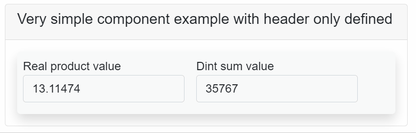

# AxoComponent

`AxoComponent` is an abstract class extending the AxoObject, and it is the base building block for the "hardware-related devices" like a pneumatic piston, servo drive, robot, etc., so as for the, let's say, "virtual devices" like counter, database, etc. `AxoComponent` is designed to group all possible methods, tasks, settings, and status information into one consistent class. As the `AxoComponent` is an abstract class, it cannot be instantiated and must be extended. In the extended class, two methods are mandatory. 

`Restore()` - inside this method, the logic for resetting the AxoComponent or restoring it from any state to its initial state should be placed.

`ManualControl()` - inside this method, the logic for manual operations with the component should be placed. To be able to control the `AxoComponent` instance manually, the method `ActivateManualControl()` of this instance needs to be called cyclically.

The base class contains two additional method to deal with the manual control of the `AxoComponent`. 
`ActivateManualControl()` - when this method is called cyclically, the `AxoComponent` changes its behavior to manually controllable and ensure the call of the `ManualControl()` method in the derived class.

`IsManuallyControllable()` -returns `TRUE` when the `AxoComponent` is manually controllable. 

**Layout attributes `ComponentHeader` and `ComponentDetails`**

The visual view of the extended `AxoComponent` on the UI side could be done both ways. Manually with complete control over the design or by using the auto-rendering mechanism of the `RenderableContentControl` (TODO add a link to docu of the RenderableContentControl) element, which is, in most cases, more than perfect.
To take full advantage of the auto-rendering mechanism, the base class has implemented the additional layout attributes `ComponentHeader` and `ComponentDetails(TabName)`. The auto-rendered view is divided into two parts: the fAxoed one and the expandable one. 
All `AxoComponent` members with the `ComponentHeader` layout attribute defined will be displayed in the fixed part. 
All members with the `ComponentDetails(TabName)` layout attribute defined will be displayed in the expandable part inside the `TabControl` with "TabName". 
All members are added in the order in which they are defined, taking into account their layout attributes like `Container(Layout.Wrap)` or `Container(Layout.Stack)`.

**How to implement `AxoComponent`**

Example of the implementation very simple `AxoComponent` with members placed only inside the Header.
[!code-smalltalk]

**How to use `AxoComponent`**

The instance of the extended `AxoComponent` must be defined inside the `AxoContext`.
[!code-smalltalk]

Inside the `Main()` method of the related `AxoContext` following rules must be applied. The `Initialize()` method of the extended instance of the `AxoComponent` must be called first.
The `Run()` method with the respective input and output variables must be called afterwards.

**How to visualize `AxoComponent`**

On the UI side use the `RenderableContentControl` and set its Context according the placement of the instance of the `AxoComponent`.
[!code-csharp]

The rendered result should then looks as follows:

In case of more complex `AxoComponent` the most important members should be placed in the fixed part (Header) and the rest of the members should be placed inside the expandable part (Details). The members inside the expandable part should be organize inside the tabs.  

**More complex `AxoComponent`**
Example of the implementation more complex `AxoComponent` with members placed also in several tabs inside the expandable part (Details).

[!code-smalltalk]

For the complex types of the `AxoComponent` it is also recomended to organize partial groups of the members into the classes as it is in this example.

[!code-smalltalk]

Instantiate and call the `AxoComponent` instance.

[!code-smalltalk]

UI side of the `AxoComponent`.
[!code-csharp]

and the rendered result:

# Alarm Level

AxoComponent provides visual indicators to represent different alarm levels. Below is an explanation of each alarm level and its corresponding visual indicator.

## 1. No Alarms
**Description**: No active alarms or messages are present. 

**Icon**: There's no visual indicator for this state.

## 2. Unacknowledged
**Description**: There are messages that are waiting for acknowledgment.

<svg xmlns="http://www.w3.org/2000/svg" width="16" height="16" fill="currentColor" class="bi bi-emoji-neutral" viewBox="0 0 16 16">
  <path d="M8 15A7 7 0 1 1 8 1a7 7 0 0 1 0 14zm0 1A8 8 0 1 0 8 0a8 8 0 0 0 0 16z"/>
  <path d="M4 10.5a.5.5 0 0 0 .5.5h7a.5.5 0 0 0 0-1h-7a.5.5 0 0 0-.5.5zm3-4C7 5.672 6.552 5 6 5s-1 .672-1 1.5S5.448 8 6 8s1-.672 1-1.5zm4 0c0-.828-.448-1.5-1-1.5s-1 .672-1 1.5S9.448 8 10 8s1-.672 1-1.5z"/>
</svg>

## 3. Active Info
**Description**: Active informational messages are present.

<svg xmlns="http://www.w3.org/2000/svg" width="16" height="16" fill="currentColor" class="bi bi-emoji-smile" viewBox="0 0 16 16">
  <path d="M8 15A7 7 0 1 1 8 1a7 7 0 0 1 0 14zm0 1A8 8 0 1 0 8 0a8 8 0 0 0 0 16z"/>
  <path d="M4.285 9.567a.5.5 0 0 1 .683.183A3.498 3.498 0 0 0 8 11.5a3.498 3.498 0 0 0 3.032-1.75.5.5 0 1 1 .866.5A4.498 4.498 0 0 1 8 12.5a4.498 4.498 0 0 1-3.898-2.25.5.5 0 0 1 .183-.683zM7 6.5C7 7.328 6.552 8 6 8s-1-.672-1-1.5S5.448 5 6 5s1 .672 1 1.5zm4 0c0 .828-.448 1.5-1 1.5s-1-.672-1-1.5S9.448 5 10 5s1 .672 1 1.5z"/>
</svg>

## 4. Active Warnings
**Description**: Active warning messages are present.

<svg xmlns="http://www.w3.org/2000/svg" width="16" height="16" fill="currentColor" class="bi bi-emoji-frown" viewBox="0 0 16 16">
  <path d="M8 15A7 7 0 1 1 8 1a7 7 0 0 1 0 14zm0 1A8 8 0 1 0 8 0a8 8 0 0 0 0 16z"/>
  <path d="M4.285 12.433a.5.5 0 0 0 .683-.183A3.498 3.498 0 0 1 8 10.5c1.295 0 2.426.703 3.032 1.75a.5.5 0 0 0 .866-.5A4.498 4.498 0 0 0 8 9.5a4.5 4.5 0 0 0-3.898 2.25.5.5 0 0 0 .183.683zM7 6.5C7 7.328 6.552 8 6 8s-1-.672-1-1.5S5.448 5 6 5s1 .672 1 1.5zm4 0c0 .828-.448 1.5-1 1.5s-1-.672-1-1.5S9.448 5 10 5s1 .672 1 1.5z"/>
</svg>

## 5. Active Errors
**Description**: Active error messages are present.

<svg xmlns="http://www.w3.org/2000/svg" width="16" height="16" fill="currentColor" class="bi bi-emoji-dizzy" viewBox="0 0 16 16">
  <path d="M8 15A7 7 0 1 1 8 1a7 7 0 0 1 0 14zm0 1A8 8 0 1 0 8 0a8 8 0 0 0 0 16z"/>
  <path d="M9.146 5.146a.5.5 0 0 1 .708 0l.646.647.646-.647a.5.5 0 0 1 .708.708l-.647.646.647.646a.5.5 0 0 1-.708.708l-.646-.647-.646.647a.5.5 0 1 1-.708-.708l.647-.646-.647-.646a.5.5 0 0 1 0-.708zm-5 0a.5.5 0 0 1 .708 0l.646.647.646-.647a.5.5 0 1 1 .708.708l-.647.646.647.646a.5.5 0 1 1-.708.708L5.5 7.207l-.646.647a.5.5 0 1 1-.708-.708l.647-.646-.647-.646a.5.5 0 0 1 0-.708zM10 11a2 2 0 1 1-4 0 2 2 0 0 1 4 0z"/>
</svg>

---