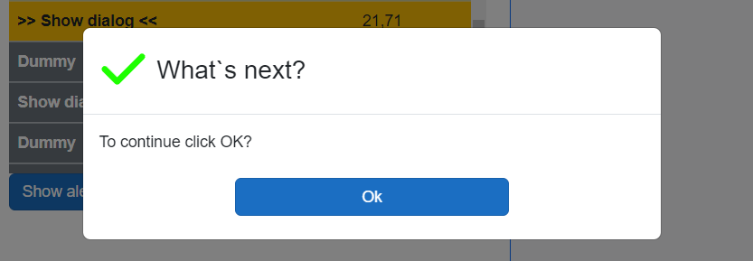
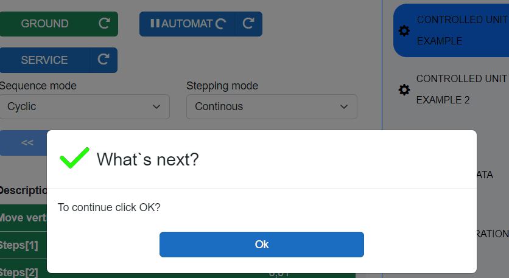
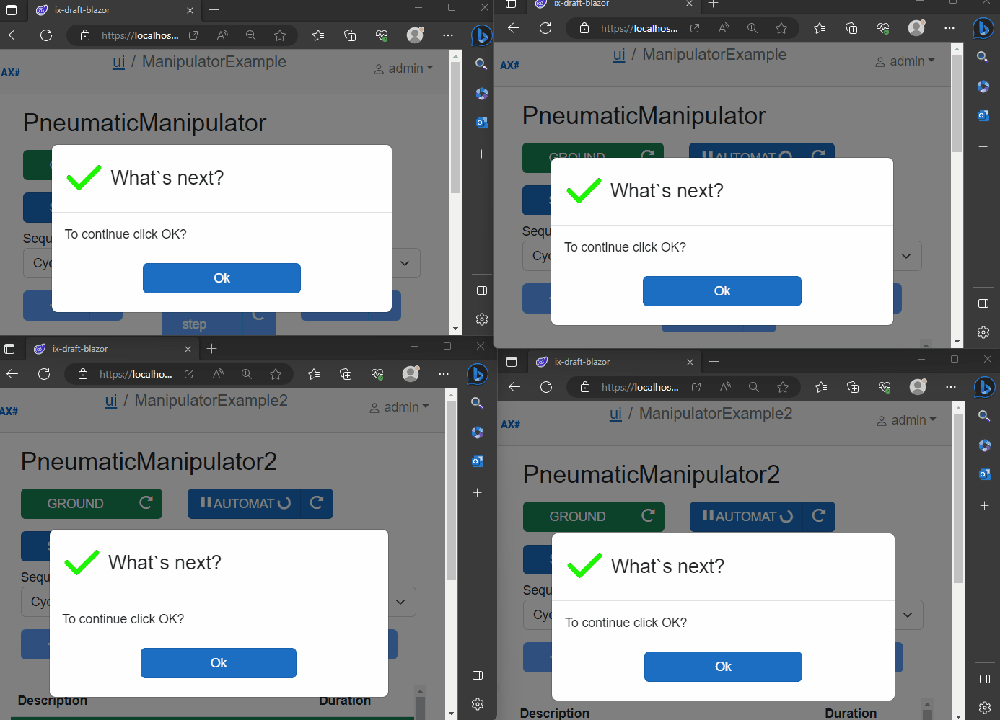
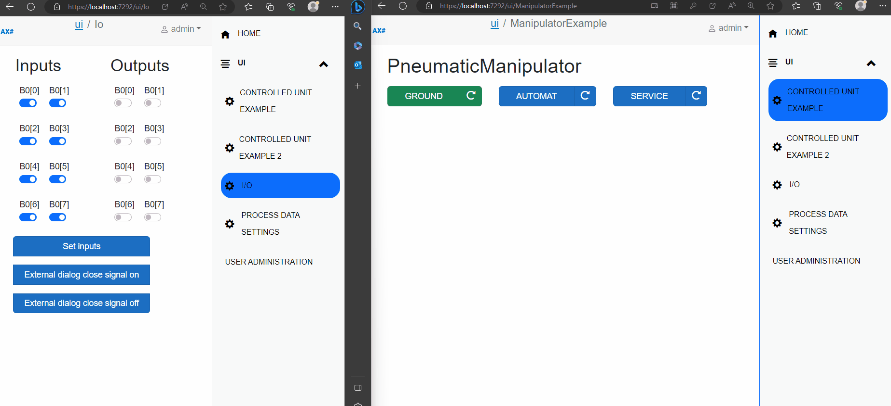

# AxoDialogs

AxoDialogs provide capability to interact with the user by rising dialogs directly from the PLC program.

## Example


```
VAR PUBLIC
    _dialog : AXOpen.Core.AxoDialog;
END_VAR
//----------------------------------------------

IF(_dialog.Show(THIS)
    .WithOk()
    .WithType(eDialogType#Success)
    .WithCaption('What`s next?')
    .WithText('To continue click OK?').Answer() = eDialogAnswer#OK) THEN

    //if answer is ok, move next in sequence                                 
    THIS.MoveNext(); 

END_IF;	
```



## Getting started 

1. Make sure your Blazor application references `axopen_core_blazor` project and AxoCore services are added to builder in `Program.cs` file. Also, map `dialoghub` which is needed for dialog synchronization using SignalR technology. 
```C#
builder.Services.AddAxoCoreServices();
//...
app.MapHub<DialogHub>("/dialoghub");
```


2. Go to your page, where you wish to have dialogs and include `AxoDialogLocator` component at the end of that page.

Provide list of `ObservedObjects`, on which you want to observe dialogs. You can also provide `DialogId`, which serves for synchronization of dialogs between multiple clients. If `DialogId` is not provided, the current *URI* is used as an id.

> [!IMPORTANT]
> Make sure, that each page has only one instance of `AxoDialogLocator` and that provided `DialogId` is unique across the application! If you wish to observe multiple objects, add them into `ObservedObjects` list.

```HTML
<AxoDialogLocator DialogId="custation001" ObservedObjects="new[] {Entry.Plc.Context.PneumaticManipulator}"/>
```

Now, when dialog is invoked in PLC, it will show on all clients and pages, where `AxoDialogLocator` is present with corresponding observed objects. The answers are synchronized across multiple clients.

## AxoDialog types

AxoDialogs contains currently 3 types of predefined dialogs:

1. Okay dialog
2. YesNo dialog
3. YesNoCancel dialog




Also, the visual type of corresponding dialog can be adjusted with `eDialogType` enum, which is defined as follows:
```
 eDialogType : INT (
    Undefined := 0,
    Info := 10,
    Success := 20,
    Danger := 30,
    Warning := 40
);

```

## Answer synchronization on multiple clients

Answers of dialogs are synchronized across multiple clients with the SignalR technology. 




## Closing a dialog with external signal

External signals can be provided to dialog instance within a `ShowWithExternalClose` method, which can be then used to close dialog externally (for example from other page of application, or by pressing a hardware button...).

4 different signals can be monitored in `ShowWithExternalClose` method:
- inOkAnswerSignal 
- inYesAnswerSignal 
- inNoAnswerSignal
- inCancelAnswerSignal 


Below is an example of closing dialog with `_externalCloseOkSignal` bool variable, which is set in other part of application:

```
VAR PUBLIC
    _dialog : AXOpen.Core.AxoDialog;
    _externalCloseOkSignal : BOOL;
    _dialogAnswer : eDialogAnswer;
END_VAR

//----------------------------------------------
_dialogAnswer := _dialog.ShowWithExternalClose(THIS, _externalCloseOkSignal)
.WithOK()
.WithType(eDialogType#Info)
.WithCaption('Hello world!')
.WithText('You can also close me externally!').Answer();

IF(_dialog3Answer = eDialogAnswer#Ok) THEN
    // if answer is provided, move next
    THIS.MoveNext(); 

END_IF;	
```



## Creation of own modal dialog


### PLC side
- Create own PLC instance of dialog, which extends `AxoDialogBase`.

- Define dialog structure and corresponding show method, which will initialize and invoke remote task needed for dialog creation.

### Blazor side
- Define Blazor view of modal dialog, which is then generated by `RenderableContentControl` according to presentation pipeline.
For example, when Dialog plc type is `MyCustomModal`, the view must by named `MyCustomModalDialogView`, because implementation is using `Dialog` presentation type.

    The Blazor view must inherits from `@AxoDialogBaseView<MyCustomModal>`, where correct generic type of dialog from PLC must be passed. The opening/closing of dialog is managed in base class by virtual methods, which can be overridden if needed.

    It is recommended to use provided `ModalDialog` Blazor component, which can be customized by user needs and is fully compatible with closing/opening synchronization approach provided in base class. Otherwise, the open/close virtual methods from base class must be overridden and accordingly adapted.
<!-- 
Example implementation of basic dialog can be found in [AxoDialogDialogView.razor](../app/ix-blazor/axopencore.blazor/AxoDialogs/AxoDialogDialogView/AxoDialogDialogView.razor). -->


