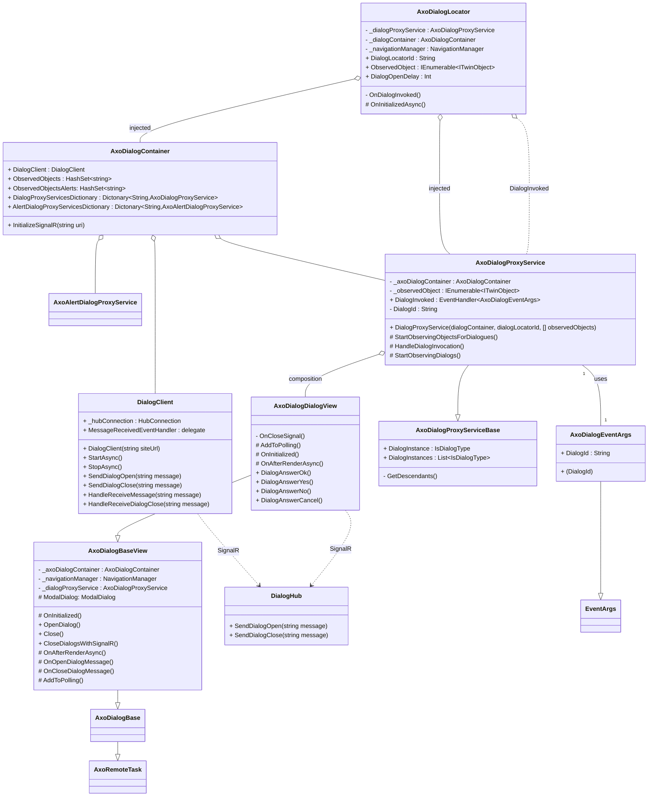

# AxoDialogs

AxoDialogs provide capability to interact with the user by rising dialogs directly from the PLC program.

## Prerequisities

1. Make sure your Blazor application references `axopen_core_blazor` project and AxoCore services are added to builder in `Program.cs` file. Also, map `dialoghub` which is needed for dialog synchronization using SignalR technology. 
```C#
builder.Services.AddAxoCoreServices();
//...
app.MapHub<DialogHub>("/dialoghub");
```


2. Go to your page, where you wish to have dialogs and include `AxoDialogLocator` component at the end of that page.

Provide list of `ObservedObjects`, on which you want to observe dialogs. Also provide `DialogId`, which serves for synchronization of dialogs between multiple clients. If `DialogId` is not provided, the current *URI* is used as an id.

> [!IMPORTANT]
> Make sure, that each page has only one instance of `AxoDialogLocator` and that provided `DialogId` is unique across the application! If you wish to observe multiple objects, add them into `ObservedObjects` list.

```HTML
<AxoDialogLocator DialogId="custation001" ObservedObjects="new[] {Entry.Plc.Context.PneumaticManipulator}"/>
```

Now, when dialog is invoked in PLC, it will show on all clients and pages, where `AxoDialogLocator` is present with corresponding observed objects. The answers are synchronized across multiple clients.

## .Net integration





