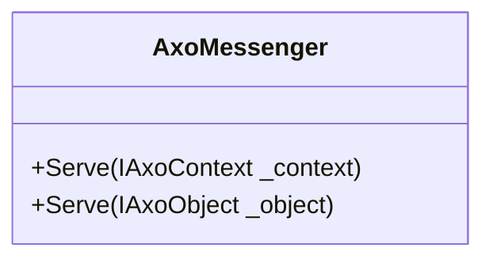

# AxoMessenger

Static `AxoMessenger` is a class that provides a mechanism for delivering static messages to the supervising applications (SCADA/HMI). This static messenger uses the text defined in the declaration. This text cannot be changed during runtime as the text is "transferred" just once during the compilation, and it is not read during the runtime. The PLC code of the `AxoMessenger` just ensures the activation, deactivation and acknowledgement of the messages.  

`AxoMessenger` contains the following public methods. 

`Serve()` - this method must be called cyclically. It ensures the initialization of the instance so as the deactivation of the message.

`Activate(_category)` - this method immediately activates the message of the category where the _category is of the type `eAxoMessageCategory`. Deactivation is detected after one PLC cycle without calling the method `Activate`.

`ActivateOnCondition(_condition,_category)` - this method activates the message of the category where the _category is of the type `eAxoMessageCategory` on the rising edge of the _condition and immediately deactivates the message on the falling edge of the _condition. The `ActivateOnCondition` method is designed to be called cyclically. 

`ActivateOnCondition(_messageCode,_condition,_category)` - this method activates the message of the category where the _category is of the type `eAxoMessageCategory` on the rising edge of the _condition and immediately deactivates the message on the falling edge of the _condition. The `ActivateOnCondition` method is designed to be called cyclically. By using the _messageCode of value greater than zero, the proper item of the text list is used as a text message. The text list can be declared in the PLC code by using the `PlcTextList` attribute or on the .NET side.

>[!NOTE] 
>Do not use different activation methods on the same `AxoMessenger` instance. Please use just one of them.

`Restore()` - restores all members of this instance to their initial states.

Depending on the [eAxoMessageCategory](../../../docs/apictrl/abstractions/plc.AXOpen.Messaging.eAxoMessageCategory.html) the messenger should require the acknowledgement.

By default the acknowledgement is not required for the levels `Trace`,`Debug`,`Info`,`TimedOut`,`Notification` and `Warning`. 
This could be overwritten by calling the `RequireAcknowledgement()` method. 
Contrariwise, the acknowledgement is required for the levels `Error`,`ProgrammingError`,`Critical`,`Fatal` and `Catastrophic` by default. This could be overwritten by calling the `DoNotRequireAcknowledgement()` method. 

**Attributes `MessageText`, `Help` and `PlcTextList`**

These attributes are used to set the values of the static texts of the messenger. These values are read out at the compilation time, transferred to .NET counterpart and set as constant strings. Therefore, they can't be changed at the runtime.

Example of declaration of the instance and defining the attributes `MessageText` and `Help`.
[!code-smalltalk]

Example of declaration of the instance and defining the attribute `PlcTextList`.
[!code-smalltalk]

**How to use `AxoMessenger`**

The instance of the `AxoMessenger` must be defined inside the `AxoContext` or `AxoObject`. 
Inside the `Main()` method of the related `AxoContext` or inside the cyclically called method of the `AxoObject`, the following rules must be applied. The `Serve()` method of the instance of the `AxoMessenger` must be called cyclically.
The `Activate` method should be used called the required condition, or the `ActivateOnCondition` method should be called cyclically. 
In the case of `ActivateOnCondition` method is used without `_messageCode` parameter for the `MessageText` and `Help`, the values from the attributes `MessageText` and `Help` defined in the PLC code are used.
In the case of `ActivateOnCondition` method is used with `_messageCode` parameter greater than zero for the `MessageText` and `Help`, the values from the text list are used. 
In the case of `PlcTextList` attribute is defined, the parsed values from this attribute are used. In the case of `PlcTextList` attribute is not defined, the text list should be defined on the .NET side as in the example below.
[!code-csharp]

Avoid mixing several activation principles with the same instance.
[!code-smalltalk]

If necessary, the default behaviour of the acknowledgeable messenger should be changed as follows.
[!code-smalltalk]
Contrariwise, the default behaviour of the unacknowledgeable messenger should be changed as follows.
[!code-smalltalk]

**How to visualize `AxoMessenger`**

On the UI side, use the `RenderableContentControl` and set its Context according to the placement of the instance of the `AxoMessenger`.
[!code-csharp]

See also [AxoLogger](AXOLOGGER.md#axologger-and-axomessenger)