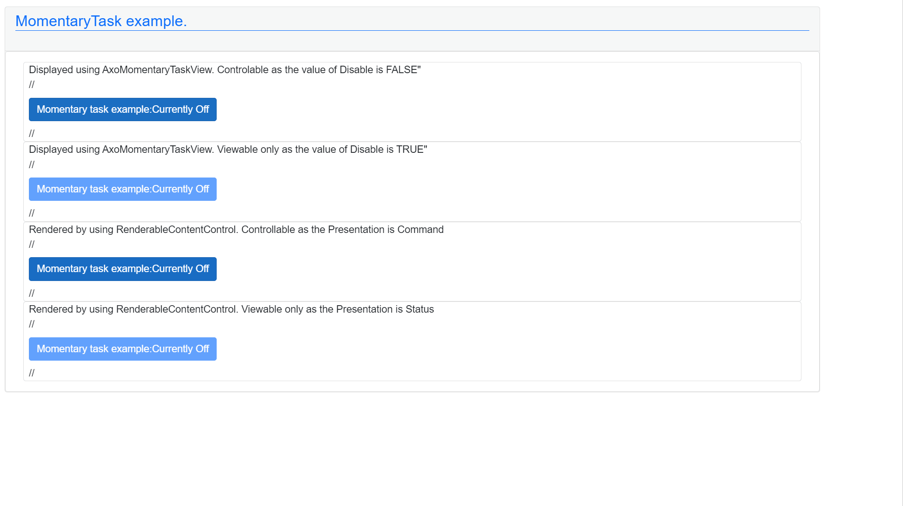

# AxoMomentaryTask

AxoMomentaryTask provides basic  momentary function. It is mainly designed for some manual operations from the UI side. AxoMomentaryTask needs to be initialized to set the proper AxoContext.

**AxoMomentaryTask initialization within a AxoContext**

[!code-smalltalk]

To check the state of the task there are two methods:
- `IsSwitchOn()` - returns `TRUE` if the state of the task is `TRUE`.
- `IsSwitchOff()` - returns `TRUE` if the state of the task is `FALSE`.

Example of using `IsSwitchOn()` method:
[!code-smalltalk]

Example of using `IsSwitchOff()` method:
[!code-smalltalk]

Moreover, there are five more "event-like" methods that are called when a specific event occurs (see the chart below). 

To implement any of the already mentioned "event-like" methods the new class that extends from the `AxoMomentaryTask` needs to be created. The required method with `PROTECTED OVERRIDE` access modifier needs to be created as well, and the custom logic needs to be placed in.
These methods are:
- `OnSwitchedOn()` - executes once when the task changes its state from `FALSE` to `TRUE`.
- `OnSwitchedOff()` - executes once when the task changes its state from `TRUE` to `FALSE`.
- `OnStateChanged()` - executes once when the task changes its state.
- `SwitchedOn()` - executes repeatedly while the task is in `TRUE` state.
- `SwitchedOff()` - executes repeatedly while the task is in `FALSE` state.

Example of implementing "event-like" methods:

[!code-smalltalk]

**How to visualize `AxoMomentaryTask`**

On the UI side there are several possibilities how to visualize the `AxoMomentaryTask`.
You use the `AxoMomentaryTaskView` and set its Component according the placement of the instance of the `AxoMomentaryTask`.
Based on the value of `Disable` the control element could be controllable:
[!code-csharp]
or display only:
[!code-csharp]

The next possibility is to use the `RenderableContentControl` and set its Context according the placement of the instance of the `AxoMomentaryTask`.
Again as before the element could be controlable when the value of the `Presentation` is `Command`:
[!code-csharp]
or display only when the value of the `Presentation` is `Status`
[!code-csharp]

The displayed result should looks like:

