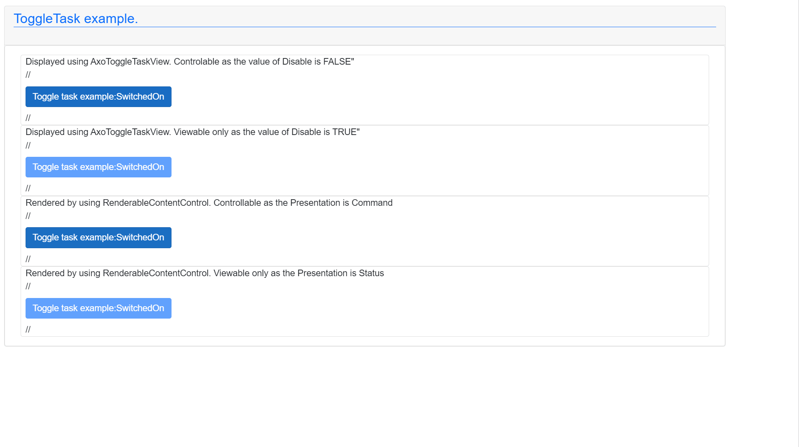

# AxoToggleTask

AxoToggleTask provides basic switching on and off functions. AxoToggleTask needs to be initialized to set the proper AxoContext.

**AxoToggleTask initialization within a AxoContext**

[!code-smalltalk]

There are three key methods for managing the AxoToggleTask:

- `SwitchOn()` -ones is called and the `AxoToggleTask` is not Disabled, changes the state of the `AxoToggleTask` to `TRUE` if its previous state was `FALSE`. (can be called fire&forget or cyclically). The method returns `TRUE` if the change of the state was performed, otherwise `FALSE`.
- `SwitchOff()` -ones is called and the `AxoToggleTask` is not Disabled, changes the state of the `AxoToggleTask` to `FALSE` if its previous state was `TRUE`. (can be called fire&forget or cyclically). The method returns `TRUE` if the change of the state was performed, otherwise `FALSE`.
- `Toggle()` -ones is called and the `AxoToggleTask` is not Disabled, changes the state of the `AxoToggleTask` to `TRUE` if its previous state was `FALSE` and vice-versa . (can be called fire&forget or cyclically). The method returns `TRUE` if the change of the state was performed, otherwise `FALSE`.

The methods `SwitchOn()` and `SwitchOff()` are designed to be used inside automatic logic, where change to exact value has to be performed, while `Toggle()` is designed to be used mostly in connection with manual control.

Example of using `SwitchOn()` method with its return value.
[!code-smalltalk]

Example of using `SwitchOff()` method with its return value.
[!code-smalltalk]

Example of using `Toggle()` method with its return value.
[!code-smalltalk]

To check the state of the task there are two methods:
- `IsSwitchOn()` - returns `TRUE` if the state of the task is `TRUE`.
- `IsSwitchOff()` - returns `TRUE` if the state of the task is `FALSE`.

Example of using `IsSwitchOn()` method:
[!code-smalltalk]

Example of using `IsSwitchOff()` method:
[!code-smalltalk]

Moreover, there are five more "event-like" methods that are called when a specific event occurs (see the chart below). 

To implement any of the already mentioned "event-like" methods the new class that extends from the `AxoToggleTask` needs to be created. The required method with `PROTECTED OVERRIDE` access modifier needs to be created as well, and the custom logic needs to be placed in.
These methods are:
- `OnSwitchedOn()` - executes once when the task changes its state from `FALSE` to `TRUE`.
- `OnSwitchedOff()` - executes once when the task changes its state from `TRUE` to `FALSE`.
- `OnStateChanged()` - executes once when the task changes its state.
- `SwitchedOn()` - executes repeatedly while the task is in `TRUE` state.
- `SwitchedOff()` - executes repeatedly while the task is in `FALSE` state.

Example of implementing "event-like" methods:

[!code-smalltalk]

**How to visualize `AxoToggleTask`**

On the UI side there are several possibilities how to visualize the `AxoToggleTask`.
You use the `AxoToggleTaskView` and set its Component according the placement of the instance of the `AxoToggleTask`.
Based on the value of `Disable` the control element could be controllable:
[!code-csharp]
or display only:
[!code-csharp]

The next possibility is to use the `RenderableContentControl` and set its Context according the placement of the instance of the `AxoToggleTask`.
Again as before the element could be controlable when the value of the `Presentation` is `Command`:
[!code-csharp]
or display only when the value of the `Presentation` is `Status`
[!code-csharp]

The displayed result should looks like:

