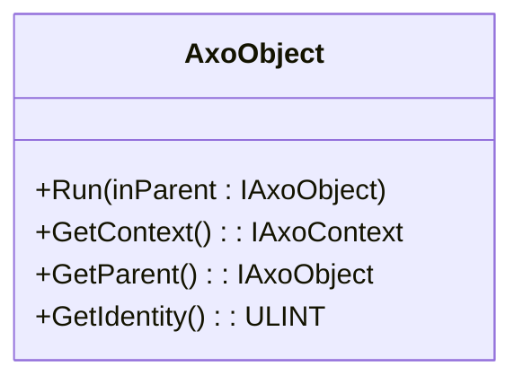

# AxoObject

`AxoObject` is the base class for all AXOpen framework objects. It provides access to the parent object, the root `AxoContext`, and framework services (logger, messenger, RTC, RTM) through the context chain.

Every object in an AXOpen application forms a tree rooted at an `AxoContext`. The tree is built by calling `Run(inParent)` cyclically — this establishes the parent chain and gives each object access to context services.

## Initialization

### Within an AxoContext (root level)

Use `InitializeRootObject()` on the context to wire a top-level object:

[!code-smalltalk]

### Within another AxoObject (nested)

Call `Run(THIS)` from the parent object — the child inherits the parent's context automatically:

[!code-smalltalk]

## Key API

| Method | Returns | Description |
|--------|---------|-------------|
| `Run(inParent)` | — | Must be called **cyclically**. Establishes context chain and executes the object. Call `SUPER.Run(inParent)` first when overriding. |
| `GetContext()` | `IAxoContext` | Returns the root context. Use to access services: `THIS.GetContext().GetLogger()`, `THIS.GetContext().GetRtc()` |
| `GetParent()` | `IAxoObject` | Returns the immediate parent in the object tree |
| `GetIdentity()` | `ULINT` | Returns a unique identity assigned by the context — used for .NET twin mapping and logger sender tracking |

## Rules

- `Run(inParent)` must be called **every PLC cycle** and **before** any other method on the object
- When overriding `Run()`, always call `SUPER.Run(inParent)` **first**
- Guard against `NULL` parent: `IF (inParent = NULL) THEN RETURN; END_IF;`
- Zero-argument `Run()` is **not allowed** for types deriving from `AxoObject` — always pass a parent
- Do not use `AxoObject` where `AxoComponent` is more appropriate (technology units with Restore/ManualControl should extend `AxoComponent`)
