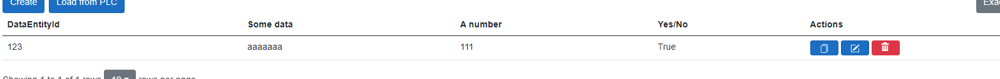

# Custom columns

There is a possibility to add custom columns if it is needed. You must add `AXOpen.Data.ColumnData` view as a child in `DataView`. The `BindingValue` must be set in `ColumnData` and contains a string representing the attribute name of custom columns. If you want to add a custom header name, you can set the name in `HeaderName` attribute. Also, there is an attribute to make the column not clickable, which is clickable by default. The example using all attributes:

[!code-smalltalk]

When adding data view manually, you will need to create ViewModel:

[!code-smalltalk]

> [!NOTE]
> When creating ViewModel, don't forget to provide AlertDialogService and AuthenticationProvider.

> [!NOTE]
> In `AxoDataFragmentExchange`, `Custom columns` can only be added from master fragment (the first declared repository).
