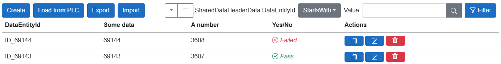

# Custom Columns

It is possible to add custom columns if needed. Add an `AXOpen.Data.ColumnData` view as a child of the `DataView`.

- `BindingValue` (required): A string representing the member path in the POCO object.
- `HeaderName`: Sets the column header text. The default value is equal to `BindingValue`.
- `PresentationTemplate`: The type of presentation template used to display the value. Template must inherits from AXOpen.Data.ColumnDataCellBase. It will be populated with the POCO value. By default, the value is presented as a string.
- `Clickable`: Determines whether the column is clickable. The default is **clickable**.

---

[!code-smalltalk]

When adding data view manually, you will need to create ViewModel:

[!code-smalltalk]

> [!NOTE]
> When creating ViewModel, don't forget to provide AlertDialogService and AuthenticationProvider.

> [!NOTE]
> In `AxoDataFragmentExchange`, `Custom columns` can only be added from master fragment (the first declared repository).

[!include]
