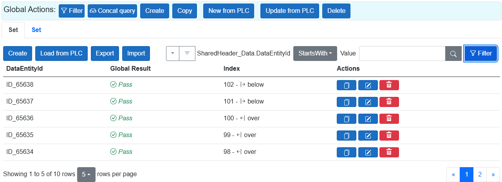

# 📦 Distributed Data View (Blazor)

The `DistributedDataView` is dynamic component for dispalying data from IDistributedDataExchangeService in a Blazor application.
---

# Usage (Blazor)

[!code-smalltalk]

### Parameters:
- GroupName: Group of data fragments to display ("default").

- ConfigSuffix: Enable extend the name of AxoDataExchange configuration for the same type (Usable in a case, you need special columns,sorting ...).

- Presentation: Data rendering mode ("Command", "Status", etc.).

- EnableExport: Allows exporting data from fragments.

- EnableSorting: Enables sorting in .

- DisplayOnePerDataType: Only one fragment per DataExchange type.

---
# Prerequisites (.Net)

### Register services
Register services in your 'Program.cs' file
[!code-csharp]

### Collect AxoDataExchanges
[!code-csharp]

### Ordering AxoDataExchanges
To define the **main exchange** for a group, use the following code in your Program.cs:
[!code-csharp]

### Fill up exchange configuration
[!code-csharp]
     
---
# Prerequisites (Ax)
To enable automatic collection of data exchanges, you must use the appropriate attribute in your PLC code, like this:  
[!code-csharp]

     
