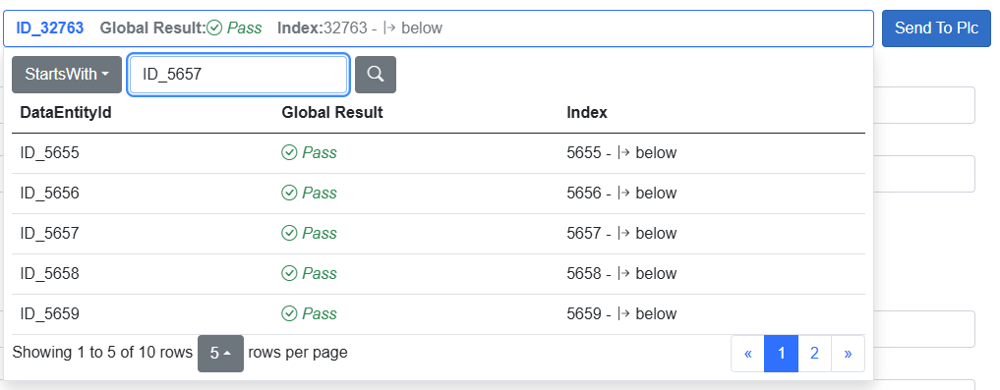
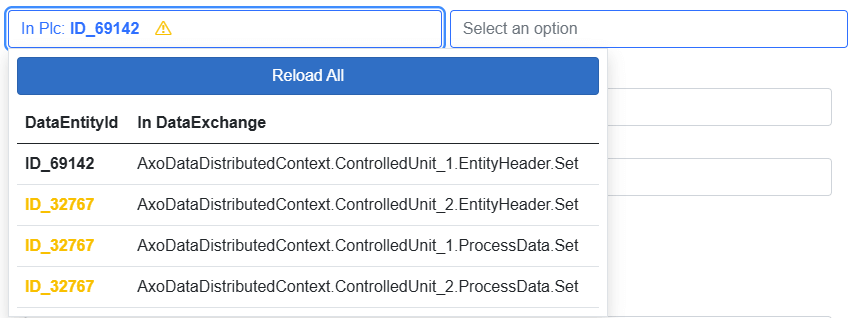

## Distributed Data Selector

Enables sending data to a **Data Exchange group** consisting of multiple instances of `AxoDataExchange`.

As shown above, the left side displays the current `EntityId` in the PLC. On the right side, there's a button that allows you to select any available entity.

The **selection button** displays several columns of data defined for the **main data exchange** in the group. To define the **main exchange** for a group, use the following code:

[!code-csharp]

The **Send to PLC** button writes data to **all data exchange instances** in the group.

---

### Entity ID mismatch warning

If **not all exchanges have the same `EntityId`**, a **yellow warning triangle** is displayed.

Clicking the triangle opens the selection interface, allowing you to correct or review the entity assignments.
