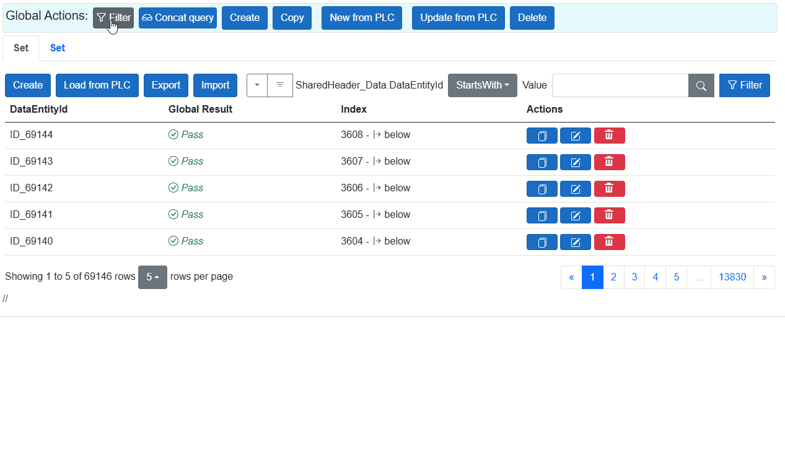

# 🔍 FILTER

Enables dynamic data filtering. Filter and sort operations can be configured dynamically based on members of PLAIN data objects across multiple repositories or exchanges.

To use filtering, the user must have the permission: `can_data_filter_advanced`.

The same filtering principle is used as described in the  
[Filter documentation](Filter.md).

---

## 🔗 Concat Query

As shown in the image above, after applying a filter, the **Concat Query** option is automatically enabled.

Once a filter is applied, a target repository is selected, and all related `DataEntityIds` matching the filter are retrieved.  
The next step is to **intersect** these results across the fragments. The outcome is a list of `EntityIds` that must be transmitted between the fragment views.

If you apply an additional filter within a specific fragment, the injected `EntityIds` will be intersected again with the previous result — refining the dataset further.

