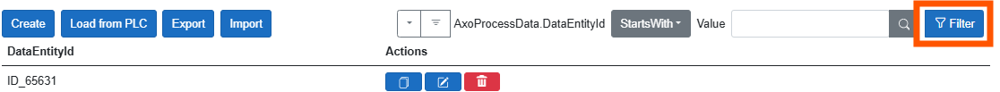
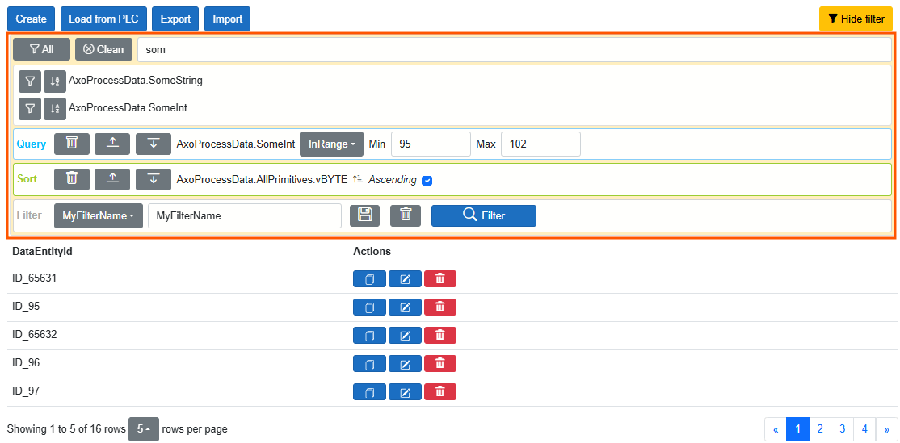
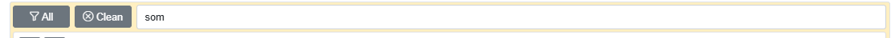
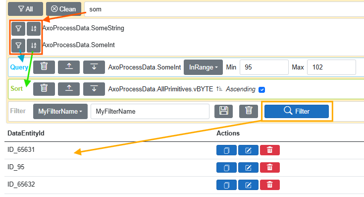

# 🔍 FILTER

Enables dynamic data filtering. Filter and sort operations can be configured dynamically based on members of the PLAIN data object.

To use filtering, the user must have the permission: `can_data_filter_advanced`.

[All user roles from AxOpen.Data](Security.md#-authorization).

---

## 📋 Filter Content

---

## 🔎 Selecting Filter/Sort Members

- The **"All"** button adds all displayed members to the filter.
- The **"Clean"** button clears the search input, which causes the filtered members to be hidden.
- The input field will find members whose names contain the entered pattern.

> [!IMPORTANT]  
> Filtering depends on PLAIN members.  
> If you are using a mapping layer (e.g., with a MongoDB driver), avoid filtering based on **remapped** or **ignored** members, as this may cause exceptions.

---

## 🛠️ Procedure

> [!IMPORTANT]  
> The filtering mechanism applies an **AND** condition across all defined items in the query area.  
> For better performance, prioritize filtering on members that are **indexed** in the database.
