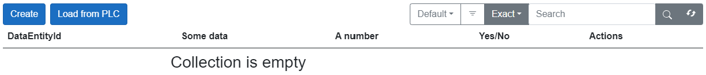

# Sorting

To enable sorting options, set the attribute `EnableSorting` to true and specify the list `SortElements` with the names of the attributes as strings.

If you are using custom columns and `EnableSorting` is set to true, these columns will be automatically added to `SortElements`.

The example of usage:

[!code-smalltalk]

