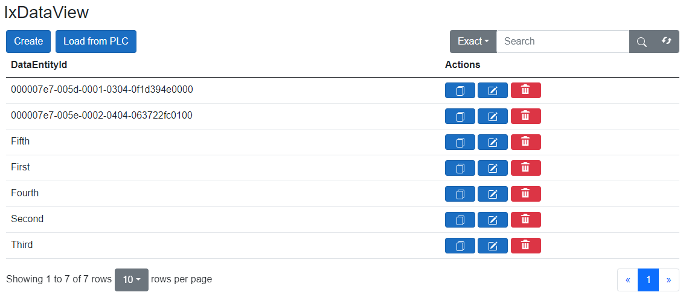
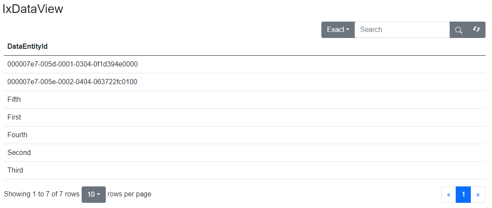

# Data visualization

## Automated rendering using `RenderableContentControl`

With `Command` presentation type, options exist for adding, editing, and deleting records.

[!code-smalltalk]

If you use `Status` presentation type, data will be only displayed and cannot be manipulated.

[!code-smalltalk]

