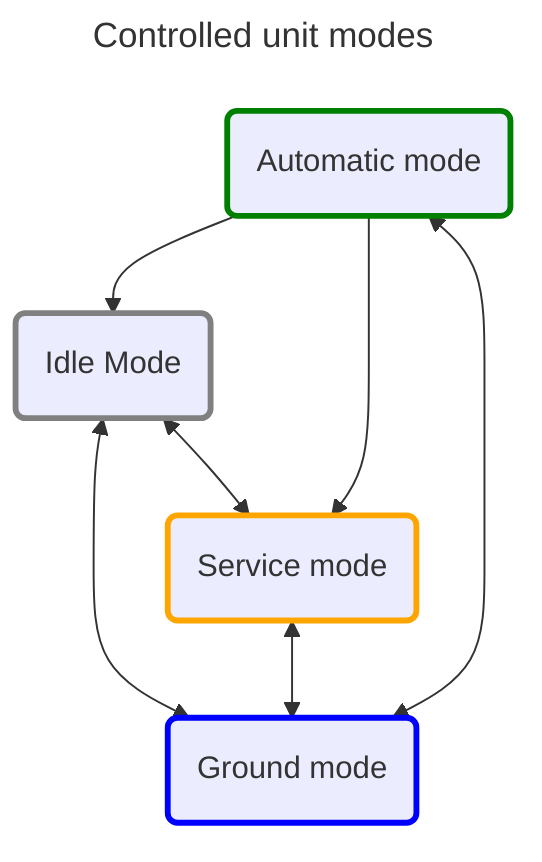

## Controlled Unit Modes
Modes are essential for the Controlled Unit to effectively and safely use Components for various tasks and scenarios. In our case, we primarily use four major modes.

### Idle Mode
In this mode, the controller/PLC does not control the technology. This mode is primarily used after powering on the technology.

### Service mode
The operator manually controls the Controlled Unit through the operating/service elements of Components.

### Ground Mode
The primary objective of this automatic [sequence](../../core/docs/AXOSEQUENCER.md) is to prepare the components for a safe transition to Automatic Mode. This sequence typically addresses all possible states of the Component following Service Mode or an interruption in Automatic Mode.

### Automatic mode
The Controlled Unit controls Components automatically in a cyclic loop, according to the control [sequence](../../core/docs/AXOSEQUENCER.md).

[!include[Ref](Navigation.md)]
