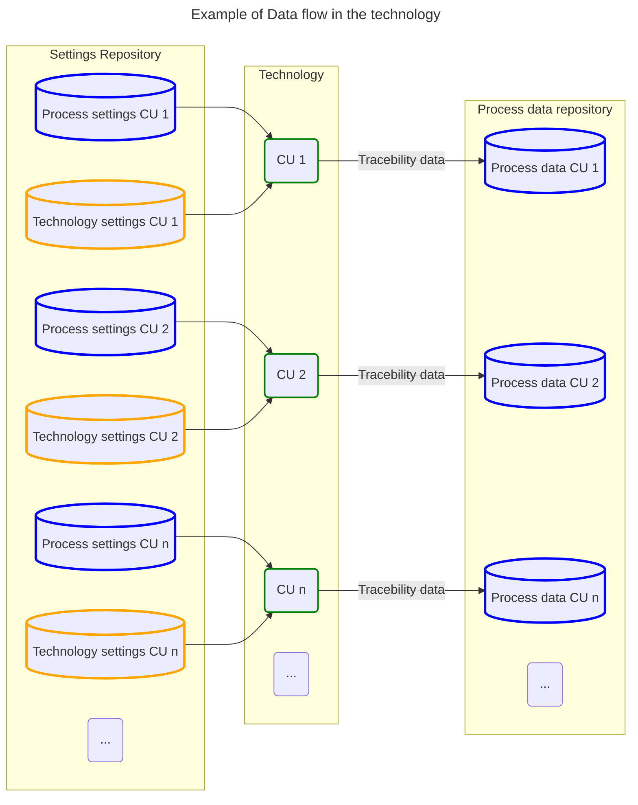

## Data used in the technology

### Technological Settings
These data are associated with the machine settings and do not have a direct connection to the product. They can include, for example, motor speeds, positions of manipulators, and other settings that have some impact on the product.

### Process Settings
These data contain settings related to the product, including the settings of Inspectors and other required process settings.

### Process Data
This is the same data structure as a Process Settings. But filled by results. Therefore, the data include both settings and outcomes related to the product.

### Traceability Data
Traceability data are data collected during the process. They can include various values such as pressure, temperature, height, position, or scanned codes of the input material, etc.

For storing values without additional parameters, base type values may be used. In this framework, [Inspectors](../../inspectors/docs/README.md)  ensure the storage of values with additional settings, such as limits and timestamps.

[!include[Ref](Navigation.md)]

